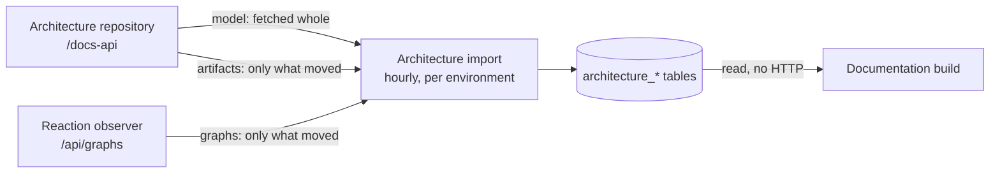

# Importing the architecture repository

Everything the doc service reads from another service - the model, the OpenAPI specifications and the database
schemas from the architecture repository, and the reaction graphs from the [reaction
observer](#the-reactions-a-second-upstream-under-the-same-job) - is imported into its own database by **one
job, per environment, on one schedule**. A documentation build reads what was imported and calls neither of
them at all.



The point of it is that a documentation build no longer depends on a service that may be deploying. When the
architecture repository cannot be read, the site goes on being published from the landscape the last successful
import stored, and every generated page names the import its content came from.

## The seven kinds

| Kind                  | What it is                                             | Read from               | How it is read                  |
|-----------------------|--------------------------------------------------------|-------------------------|---------------------------------|
| `MODEL`               | The systems, their components, relations and messages  | Architecture repository | Fetched whole, replaced whole   |
| `OPENAPI_SPEC`        | The OpenAPI specification a component publishes        | Architecture repository | Only where its entity tag moved |
| `DATABASE_SCHEMA`     | The database schema a component publishes              | Architecture repository | Only where its entity tag moved |
| `MESSAGE_SCHEMA`      | The Avro schemas of a message type version             | Architecture repository | Only where its entity tag moved |
| `SYSTEM_REACTIONS`    | The reaction graph of a system                         | Reaction observer       | Only where its entity tag moved |
| `COMPONENT_REACTIONS` | The reaction graph of a component                      | Reaction observer       | Only where its entity tag moved |
| `MESSAGE_REACTIONS`   | The reaction graphs of a message type, one per variant | Reaction observer       | Only where its entity tag moved |

**The difference is not a preference, it is what the upstream does.** The architecture repository computes the
entity tag of a model resource by serializing the whole body and hashing it, so answering "not modified" costs
it exactly what answering with the body costs - a conditional request there would save this service some bytes
and the architecture repository nothing. The tag of an artifact comes from a stored hash, so there a conditional request
costs the upstream nothing and saves a blob on the wire. A message type version's tag is computed over the
serialized body like a model's - so revalidating one is not free, and it is done because the upstream's contract
requires it rather than because it costs nothing.

## The model: fetched whole, written whole

There is no diff and no synchronisation. One run fetches the whole landscape, and if it is not the landscape
already stored, replaces it in a single transaction.

1. The list of systems, then each system's topology and its messages.
2. If what was fetched hashes to what is already stored, nothing is written.
3. Otherwise, in one transaction: delete every system of the environment, delete its teams, insert the
   landscape, and remove the artifacts it orphans.

Four things follow, and each is a simplification:

- **A build always reads one consistent moment**, never a landscape half of which is an hour older. The write
  is only half of what that takes - see [reading it](#reading-a-landscape-while-one-is-being-written) below.
- **All or nothing.** A run that cannot read every system writes nothing and leaves the stored landscape
  serving. A landscape missing one system is not a landscape.
- **Nothing has to detect a deletion.** A system removed upstream is simply absent from the next insert.
- **The hash is one comparison, not a diff.** Without it every run would rewrite every row to store what was
  already there, fifteen times a day.

What the hash is taken over matters as much as that it exists. It is taken **in the documented order** - how the
architecture repository happens to order its answer is not part of the landscape - and a component's
`lastSeen` counts **by the day**: an importer upstream advances it continuously, so hashing it to the second is
hashing a clock, and the comparison would never match. By the day it fires for twenty-three runs out of
twenty-four, the *Last seen* a page shows is at most a day behind, and the fortnight after which a component
counts as stale is far coarser than that either way. Everything else is hashed from the records themselves, so a
field added anywhere in the tree is covered without anybody remembering to add it - at the price of one rewrite
per environment when it is.

An answer that carries **no list of systems at all** fails the run rather than reading as a landscape without
systems: a run that fetches no system replaces the stored model with an empty one, and Spring hands out a null
body for any zero-length `200`. A landscape that really has none answers with an empty list.

**Every name the index lists has to answer with itself.** A system is addressed upstream by name *or by alias*,
so an alias of one system that is the name of another makes both entries answer with the same system - and
importing that documents it twice, the second time under a name that is not its own: a page tree saying one
thing and a heading saying another, while the system whose name was taken has no pages at all. A name whose
answer is a different system is therefore **left out**, named in one `WARN` with both spellings, and the rest of
the landscape is imported as usual. It is the one thing this step leaves out rather than fails over, because it
is not a system it could not read - it is a second copy of one it already has. If *nothing* answers for itself
the run fails instead: that is an upstream not serving this landscape at all, and importing nothing would
replace the documentation of the whole environment with an empty one.

## Reading a landscape while one is being written

A build and an import can run at the same moment, and nothing stops them: the build lock is per part and the
import lock is per environment. So the read has to survive the write.

**A landscape is read out of one snapshot of the database**, at repeatable read. That is not a precaution, it is
what makes the read correct at all. Reading a landscape is ten statements - the systems, then their teams,
aliases, relations, components, REST operations, messages, versions and contracts - and each of them is keyed by
the identifiers the statement before it returned. A replace gives every row an identifier fresh from a sequence.
So at PostgreSQL's default isolation, where each statement takes a snapshot of its own, an import committing in
the middle of a read leaves the reader holding systems that no longer exist, the queries for everything below
them match nothing, and what comes back is **a landscape of systems with no components, no messages and no
relations** - which a build then publishes with nothing in the log to say so.

One snapshot for the whole read is the fix, and it costs nothing: a transaction that only reads neither blocks
the import nor can be aborted by it.

**When the content was imported is read out of that same snapshot**, off the systems themselves, so a page names
the import its content came from. It is deliberately not the same timestamp as the one the staleness warning
uses: that one is the last time the architecture repository was read *successfully*, which moves for a run that
found the landscape unchanged and wrote nothing. One says how old the content is, the other says whether the
import is still working.

What is **not** guaranteed, and does not need to be, is that a build sees an import that lands while it runs. A
build reads the landscape at its start and then spends minutes generating; a site published from the model of
twenty minutes ago is exactly what an hourly schedule means.

### The landscape is read once per import, not once per build

A part carries one system and every environment of its site, and a build of it reads the **whole** landscape of
each of those environments - a system's context view cannot be computed from that system alone. A site of fifty
parts over four environments therefore read the same four landscapes two hundred times, which was about a third
of what a full publication cost.

So a landscape is held between builds, keyed on **when that environment was last read successfully**. An import
moves that whether or not it changed anything, so everything held is dropped by the import that could have
changed it, and reading the key is one row. A stale answer is not possible, and it rests on the order the
import writes in: the landscape, then the state row, then the build requests. The import step says so where it
does it, and a test asserts the order.

Held per environment, so what it costs is one landscape each for as long as the imports keep succeeding.
`jeap.doc.archrepo.import.cache-landscape` switches it off. `jeap.doc.build.model.read` still times what each
build paid, so a hit is a sample near zero and the timer's count is how often a landscape was really read.

## The artifacts: one at a time, over the entity tags

1. The index, asked conditionally - but **only after a run that stored or confirmed everything in its list**.
   A "not modified" says the landscape is unchanged, not that everything in it was fetched, and trusting it
   after a run that was truncated, or that could not replicate an entry, would skip what was missed for ever.
2. Whatever the index no longer lists is deleted, right after the index rather than at the end, so a run that
   later runs out of time has still pruned correctly.
3. Every entry whose entity tag matches the stored one is noted as checked, and nothing is transferred.
4. The rest are fetched. What has to be fetched - unknown, or with a tag that moved - comes before what only
   has to be confirmed, and the confirmations go oldest first, so a run that keeps hitting its deadline spends
   its time on what changed and rotates through the rest instead of reconfirming the same first entries.

Each artifact is its own transaction. They are blobs and they are independent of one another, so a run that
stops early is progress rather than nothing.

An artifact larger than `jeap.doc.archrepo.import.max-artifact-size` (8 MB by default) is **not replicated**: it
is left where it is, with a warning naming it, and the run carries on with the rest. A specification that size
is a defect upstream rather than something to render. The limit bounds what one answer costs in **memory** as
well as what is stored: nothing past it is read off the wire, so the advertised length is checked before the
body and an answer that advertises none is bounded all the same. It bounds a message schema the same way.

**And it bounds a build, because a generation run reads one artifact at a time.** It asks for the artifact of
one component and one kind, parses it and keeps only what a page shows before asking for the next; a read that
answered a whole system's would put a component count's multiple of this limit live at once, on top of the
architecture model the build holds until the site generator has finished. There is deliberately no way to read
more than one artifact's content in one call.

**A redirect is not followed.** The origin of a content URL is checked before it is fetched, and a followed hop
would make that check hold for the first request only - a `302` from an on-origin path would have the body of
whatever the `Location` names stored as the specification. A `3xx` other than `304` skips the item and logs
where it pointed; where the content really is, is the upstream's to say in its index.

The same goes for an artifact that went away between the index and the fetch, one whose content URL cannot be
fetched, and one that arrives without an entity tag: **skipped, not confirmed**. The run still counts as a
success - it replicated everything else, and an upstream defect must not keep the staleness alarm on - but it
does not trust the index afterwards. The next run asks the index unconditionally and is offered the artifact
again, which is what makes a specification that was briefly gone, or that has since shrunk, come back. A run
with skipped entries says so once, at `WARN`, with the reasons logged above it.

**An answer with no list in it is a failure, not an empty index.** What a run does with an index that lists
nothing is delete every artifact stored for the environment and kind, and Spring hands out a null body for any
zero-length `200` - a proxy, a truncated answer, an architecture repository whose own import failed. Such an
answer therefore fails the run, exactly as a `404` on an index does, and the step additionally refuses to prune
to nothing while something is stored. An index that really is empty answers with an empty list, which is a
different thing and reads as one.

**A component publishing an empty specification is replicated** as the empty artifact it is, decided from the
status rather than from whether bytes arrived. Skipping it would skip it on every run for ever - and because a
skipped entry stops the run trusting the index, one empty artifact would turn the conditional requests off for
the whole kind.

**The artifacts do not point into the model.** They name their system and component, and a foreign key would
either take every blob down with the model on each import - the exact cost the entity tags exist to avoid - or
stop the model from being replaceable at all. Instead the model import sweeps the artifacts whose system or
component the fresh landscape does not have.

## The message schemas: asked about every run, fetched only when they move

A message type version is **nearly** fixed, and the word that matters is nearly. A changed schema is normally
published as a new version - but `compatibleVersion` is derived upstream from the version list, so publishing an
intermediate version changes what an *already published* version answers, and every import of the architecture
repository re-renders the schemas from the registry. Its docs API says so in as many words: a consumer must not
store a version once and never ask again.

So a version is revalidated rather than trusted. That costs a request per version per run and no payload - every resource
carries a strong `ETag` and `Cache-Control: no-cache`. **It is not free for the architecture repository**,
though: a version's tag is computed over the serialized body, not read from stored bytes the way an artifact's
is, so a `304` there saves the payload on the wire and not the work behind it. It is done because its docs API
says a consumer must not store a version once and never ask again.
One run of one environment:

1. `GET /docs-api/message-types` - the index, unconditionally. It lists every message type with its versions,
   and carries no schemas. Its own tag is not used: it covers the *list*, and a version can move without the
   list changing, so a `304` on it would not answer the question this step asks.
2. **Prune** the stored versions the index no longer lists, right after the index rather than at the end, so
   that a run which later runs out of its deadline has still pruned correctly. **Only within the message types
   the index actually reports on**: the index is served from the architecture repository's own store, so a run
   of *its* import that was itself partial lists fewer message types than exist, and treating an absent one as
   a deletion would throw away every schema of it and fetch them all back on the next run.
3. Every listed version, while the deadline holds, sending `If-None-Match` where this service holds one.
   A `304` confirms the row and rewrites nothing but its `checked_at`; anything else replaces the row.

**The order is what makes a truncated run useful**: what is not stored at all first, then what only has to be
confirmed, oldest confirmation first. A run that keeps hitting its deadline therefore spends its time on the
versions that carry no schemas yet, and rotates through the confirmations instead of reconfirming the same first
twenty for ever.

The first run after a deployment is the expensive one: every version is missing, so every version is fetched,
and a landscape large enough that this does not fit in one deadline records `PARTIAL`, keeps what it stored, and
carries on next hour where it left off.

What is stored is kept whatever goes wrong, exactly as for the artifacts: a version that answers `404` between
the index and the fetch is skipped and offered again by the next run, and an upstream that cannot be read leaves
every stored version where it is.

**Names are compared folded, everywhere.** The unique index of the store folds the system and the message type,
and so do the lookup before a store, the prune and the run's own comparison - because the model and these rows
carry the spellings of two different exports of the same upstream, and an alias or a differently-cased path
resolves to whichever the upstream stores. Comparing them exactly would leave a stored version unrecognised:
fetched in full on every run, never confirmed, and never removed when it is withdrawn.

**The index does not say which version a resource belongs to uniquely.** The architecture repository groups it
by system, kind and message type, while the version resource is addressed by system, message type and version -
so a system that defines an event and a command of one name lists the same version twice, under one content URL.
This service keys a version by the three the resource is addressed by, so the two are one row: the flattening of
the index drops the repeat, and the store replaces rather than inserts. A blind insert would violate the unique
index and record the whole environment as failed, on every run, for as long as the upstream kept listing it.

<a id="the-reactions-a-second-upstream-under-the-same-job"></a>
## The reactions: a second upstream under the same job

The three reaction kinds come from the **reaction observer** of the environment - a different service, on a
schedule of its own, which watches what actually reacts to what at runtime. They are steps of this import
rather than a job of their own because everything one needs is already here: a lock per step, a deadline, a
state row, a staleness gauge and an administration API.

**One observer per environment**, configured under `jeap.doc.reactions.environments.<environment>`, and read
with a client-credentials token carrying `<system-name>_@reactions_#read` on that stage's authorization
server. The observer offers HTTP Basic as well and this service does not use it.

**It is off by default.** A platform may run no reaction observer at all, and `jeap.doc.reactions.enabled` is
what says whether this one does. Switched on with no environment configured, the service does not start - that
way a platform without an observer and a property path with a typo do not look the same.

**And an environment configured here has to have an architecture repository.** These are steps of that
import, which runs the environments `jeap.doc.archrepo.environments` names, so an environment only the
reactions name is never visited - and it could draw nothing anyway. That one fails the startup too. An
environment with an architecture repository and no observer is the ordinary case and is not an error.

**The observer has to be recent enough to serve the replication indexes.** One call per kind lists which graphs
exist with the entity tag of each, so a round that finds nothing changed costs three requests per environment
instead of one per system, per component and per message type. An observer that answers `404` on an index is
older than the release that serves them - which is also the release that requires a resource server - and the
environment fails with a message saying so rather than being read the slow way.

### The names are resolved against the model

**The observer's names are not the model's.** It stores a system name lower-cased and a component name exactly
as the publishing service sent it, while the model has its own spellings and its aliases. So every name an
index offers is resolved against the stored model of that environment - a system by name or alias ignoring
case, a component by name within the system the observer says its reactions were published under - and **what
is stored is the model's spelling**, with the observer's kept beside it in `upstream_name`.

The observer's spelling is not only kept for the record: a message type's resource answers every variant at
once, keyed by the names the index carried, so it is `upstream_name` that addresses the answer. Picking the
variant out of it by the resolved name would lose every graph of a type the two spell differently.

Two things follow from resolving before comparing:

- **A name the model does not have is not imported**, and the run says so once with the names rather than a
  bare count. It is the normal case for a system that reacts on a platform whose model does not carry it, and
  it is also what a genuine mismatch looks like - so it is worth reading after the first import of a
  landscape. The line counts **names and graphs apart** and spells each name once with the number of graphs
  under it: a message type is listed once per variant, so a single type the model does not have can be eighty
  entries, and a warning repeating that name eighty times says nothing about how much of the index it is.
- **There is no orphan sweep.** A system that leaves the model stops being resolvable, so it stops being
  listed, so the prune that exists for a graph the observer withdrew removes its graph too.

A graph itself is **stored as it arrived**. Nothing in the import looks inside it: how a reaction graph is
drawn is decided when a page is generated, so changing the drawing needs no re-import.

## Every name becomes a slug

Turning a name into a path segment is the doc service's job, not a reason to leave something out. Diacritics
are folded, every run of characters outside `a-z0-9` becomes one hyphen, and leading and trailing hyphens are
dropped: `ORDERS` is `orders`, `Order Fulfilment` is `order-fulfilment`, `orders-payment-scs` is itself.

A derived slug is one an upload may name, because the upload API checks that the value it is given is a slug,
not how the architecture repository spells the name. So a team documenting `Order Fulfilment` uploads with
`system=order-fulfilment` and lands in the tree the generator wrote.

A message type name is camel-cased, so it is split into its words first and then folded the same way:
`OrdersCheckErpAvailabilityV2Command` is `orders-check-erp-availability-v2-command`. The slug is unique within
the system, like a component's, and `index` is refused - it is the listing of the group the page would sit in.

**Three things cannot happen, and none of them is skipped**: a name of nothing but punctuation, which yields no
slug at all; two names that yield the same slug - `OrdersFooEvent` and `Orders-Foo-Event` are one page, and the
second would be written over the first while the listing still named both; and a message whose slug is
`index`. All of them log an `ERROR` naming what collides and abandon the run, so the landscape stored before it
goes on being generated from. They are the only `ERROR` this job logs, and they mean data that should not
exist - somebody renaming it in the architecture repository is what resolves it.

A model older than `jeap.doc.archrepo.import.stale-after` (two hours by default) does not stop anything: the
build says so with a `WARN` naming the age and generates from it all the same. A site published from a model of
yesterday is worth more than no site. With an hourly schedule the threshold tolerates one failed import and
warns on the second.

**A reader of the site is told as well.** The page describing the documentation shows, per environment, when
the architecture repository was last read successfully and says *not read since* once it is behind by that same
measure. It is **fetched** rather than generated into the page: a part whose documentation has not moved is not
built again, so a page carrying the last read would keep claiming one - and the import that stopped is exactly
the case that would go unreported. See
[Generating the documentation](generation.md#what-is-true-only-now-and-why-it-is-fetched-too).

## When it runs

|                                 |                                                                                                                                                                                                                                                                                                                                                                                                                                                                                                                                                                                                                                                                                                                                                                                                                                                                                                                                                                                                 |
|---------------------------------|-------------------------------------------------------------------------------------------------------------------------------------------------------------------------------------------------------------------------------------------------------------------------------------------------------------------------------------------------------------------------------------------------------------------------------------------------------------------------------------------------------------------------------------------------------------------------------------------------------------------------------------------------------------------------------------------------------------------------------------------------------------------------------------------------------------------------------------------------------------------------------------------------------------------------------------------------------------------------------------------------|
| On a cron                       | `jeap.doc.archrepo.import.cron`, by default **once an hour at a quarter to**, through the working day. It puts a fresh import in front of every publication of a site on its default schedule - five past the hour - with twenty minutes in between: twice the deadline of the model step, which runs first and is what the pages are generated from. A run whose artifact steps are still going at five past costs nothing, because a build generates from what is stored. Hourly rather than more often because the sites are published hourly: three imports out of four would produce nothing a reader can see, and each one is a full fetch of every system of every environment - the content hash saves the *write*, never the read. **An empty value means never.** The cron only hands the environment to the `architectureImportTaskExecutor` and returns: an import never holds a scheduler thread, so the build poll and the scheduled publications beside it are not held up by it |
| Once at startup                 | Every environment that has never been imported, on the same `architectureImportTaskExecutor`, so that a slow architecture repository delays no readiness probe. It is the service's own rather than the application's: an import must not compete with request handling, and an instance is free to add starters that bring executors of their own                                                                                                                                                                                                                                                                                                                                                                                                                                                                                                                                                                                                                                              |
| One at a time                   | The executor has one thread and a bounded queue. The cron fires for every environment at the same minute, and the imports run one after the other rather than loading four architecture repositories and this JVM's heap at once. A cron that finds the queue full is dropped with a `WARN`; the next hour imports what it did not                                                                                                                                                                                                                                                                                                                                                                                                                                                                                                                                                                                                                                                              |
| One ask per chain               | **The chain asks for the documentation, once, after its last step** - not the model step that stored the landscape. Two reasons, and each one was a defect: a build asked for by the model step starts while the artifacts of the same environment are still being fetched, and publishes the landscape beside the specifications and schemas of the run before it; and a run in which the model is *unchanged* while an artifact is newly replicated - a schema whose first fetch failed and whose second succeeded - asked for nothing at all, so the page saying the schema is missing stood until the landscape happened to move. Nothing else would ask: a site an architecture repository feeds is deliberately left out of the reconcile schedule. Every part of the site is asked for, because which of them the run changed is not asked - a part whose content has not moved is not generated. **Only `REPLACED` asks**: an artifact step reports `PARTIAL` whenever any entry of its index could not be replicated, whether or not it stored the rest, so asking on that would ask for every part on every run for as long as one component's specification stays unfetchable. The run in which a failing fetch finally succeeds reports `REPLACED` and asks; a run that stores one artifact while another is still unfetchable is not published until something else moves |
| One ask per queued import       | An environment already **on the queue** is not queued twice: the second ask joins the first, which has not read anything yet, rather than putting the same fetch behind it. Ten asks in a row are one import, the way ten build triggers are one build - and without that, hammering [the API](api.md#asking-for-the-architecture-repository-to-be-imported) pushes the scheduled imports off the bounded queue                                                                                                                                                                                                                                                                                                                                                                                                                                                                                                                                                                                 |
| An ask during a run is not lost | An environment being imported **right now** is imported once more when that run ends. It is the case the API exists for - somebody has just corrected something in the architecture repository - and the run in flight may already have read it, so joining it would answer `202` for a fetch that predates the correction. Once more and not once per ask: ten asks during one import are one further import                                                                                                                                                                                                                                                                                                                                                                                                                                                                                                                                                                                   |
| Never inside a build            | That is the whole point                                                                                                                                                                                                                                                                                                                                                                                                                                                                                                                                                                                                                                                                                                                                                                                                                                                                                                                                                                         |

**Only one instance imports at a time.** The schedule fires on every instance at the same moment, so each step
of each environment runs under its own lock; an instance that does not get it does nothing at all, because
another one is importing into the same database. The lease says how long the lock survives an instance that
dies holding it, not how long the work may take - the lock is kept alive while it is held.

## When something goes wrong

Nothing an import does can fail a build.

| Situation                                                       | Model                                                                                                                                                                                                                          | Artifacts                                                                                                   |
|-----------------------------------------------------------------|--------------------------------------------------------------------------------------------------------------------------------------------------------------------------------------------------------------------------------|-------------------------------------------------------------------------------------------------------------|
| The upstream is unreachable or answers `5xx`, after its retries | The run is abandoned and nothing is written                                                                                                                                                                                    | The stored artifacts stay                                                                                   |
| `401` / `403`                                                   | The same, and the message names the client registration and the role                                                                                                                                                           | The same                                                                                                    |
| One item fails                                                  | The whole run is abandoned - a landscape missing one system is not a landscape                                                                                                                                                 | The rest of the list is still fetched                                                                       |
| One item answers `404`                                          | The landscape moved under the run: it is read again once, and a second `404` leaves it to the next run                                                                                                                         | Its row is deleted; the artifact was withdrawn                                                              |
| The deadline expires                                            | The run is abandoned, nothing is written                                                                                                                                                                                       | What was stored is kept, the next run does not trust the index, and the run does **not** count as a success |
| The instance stops                                              | The same, and it is asked between two requests - so a deployment costs an import about the time one request takes, not the shutdown budget. Logged at `INFO`: it is what every deployment does, and there is nothing to act on | The same                                                                                                    |

Every request is retried twice - three attempts in all - with exponential backoff and jitter, for a connection
failure, a read timeout, a `5xx` or a `429`. A `401`, `403` or `404` is not retried: it will answer the same
way in half a second, and retrying only delays the message that says what to fix.

## What to watch

## What it reports about itself

`jeap_doc_architecture_import_last_success_age_seconds` is the one to alarm on. An import that stops working is
invisible from the outside, because the site goes on being published from what was imported before it.

```promql
# Nothing has been imported for four hours - or never has been, which reads as NaN.
jeap_doc_architecture_import_last_success_age_seconds > 4 * 3600
  or absent(jeap_doc_architecture_import_last_success_age_seconds)
  or jeap_doc_architecture_import_last_success_age_seconds != jeap_doc_architecture_import_last_success_age_seconds
```

Every configured environment and every kind it can import is bound at startup, before any of them has run, so
a kind that is new in a deployment reads `NaN` rather than being missing - the `absent(...)` clause above is
false as soon as any other pair reports, so a missing series would not be caught by it. **The four kinds the
architecture repository serves are bound for every environment; the three reaction kinds only where that
environment has a reaction observer configured**, because an environment without one imports no reactions and a
series that could never move is a series nobody can alarm on. A pair that has been bound once keeps being
reported.

Beside it: `jeap.doc.architecture.import` times one run and tags what it did, `.items` counts what was stored,
confirmed unchanged, removed, skipped or - for the reactions - left unresolved, and
`jeap.doc.architecture.artifacts` is how many are stored. `skipped` staying above zero is something an upstream
serves and this service refuses, run after run; `unresolved` staying above zero is a name the reaction observer
lists that the stored model does not have, so those graphs are never imported and the pages that would draw
them are never written. A sudden drop in `artifacts` is an upstream that lost its data, which no failure counter
catches because the run succeeded.

**What each run did is on its row**, as `last_outcome` of `architecture_import` - `REPLACED`, `UNCHANGED`,
`PARTIAL` or `FAILED`. An environment with no architecture repository writes no row at all, and no meter either:
every step returns `NOT_CONFIGURED` before it records anything, so it appears in neither. It is not derivable from the rest of the row: a run that stopped at its
deadline stored what it had reached and is neither a success nor a failure, so reading the outcome off
`last_success_at` and `failure_reason` reported exactly that run - the one most worth telling apart - as a
failure. An outcome written by a newer version of the service reads as none rather than making the row
unreadable.

A run that stops at its deadline counts as `partial`, **not** as a success: the age gauge above goes on rising
until a run gets through its whole list, which is what makes a replication that keeps truncating visible.

A run cut short by a **deployment** counts as `partial` for the same reason, and reads the same way. That is
deliberate: an instance that is stopping imported no less than an instance that ran out of time, and the age
gauge should go on rising until an instance gets through the whole landscape.

## Bringing an import forward

A correction made in the architecture repository is invisible to the documentation until the next scheduled
import, because a build reads what was stored. `POST /api/architecture/imports` asks for every environment to
be imported now, and `POST /api/architecture/environments/{environment}/imports` for one of them - answered
`202`, run on the import thread, not durable. See [the API](api.md#asking-for-the-architecture-repository-to-be-imported).

## Related

- [Configuration](configuration.md#the-architecture-model)
- [The scheduled jobs](scheduled-jobs.md) - every job of the service, and which of them may overlap
- [Generation](generation.md)
- [Architecture](architecture.md)
- [Observability](observability.md)
