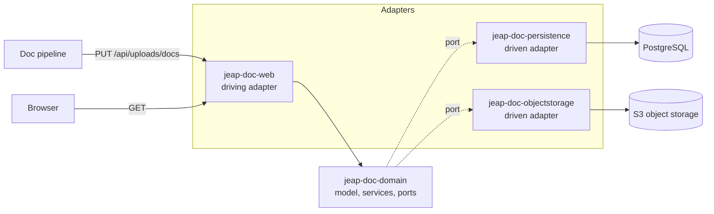

# Architecture

The doc service is built as **ports and adapters** (hexagonal architecture): the domain in the centre holds the
model and the business logic, it declares the *ports* it needs as interfaces, and the technical *adapters* around
it implement those ports or drive the domain through them. The domain therefore depends on no framework detail,
and a technology can be replaced without touching the business logic.

## Modules

| Module                      | Role            | Contents                                                                                                      |
| --------------------------- | --------------- | ------------------------------------------------------------------------------------------------------------- |
| `jeap-doc-domain`           | domain          | The model of the documentation, the services acting on it and the ports it needs (package `…doc.domain.port`) |
| `jeap-doc-persistence`      | driven adapter  | Spring Data JPA on PostgreSQL (`documentation_upload`, `documentation_subject`), and the Flyway migrations   |
| `jeap-doc-objectstorage`    | driven adapter  | S3 over the jEAP object storage starter, and the startup check of the bucket                                  |
| `jeap-doc-web`              | driving adapter | The Spring Boot application: REST API, OpenAPI, security                                                      |
| `jeap-doc-service-instance` | packaging       | POM-only module a project depends on to create its own doc service instance                                   |

### Rules the modules follow

- The domain module depends on no adapter module, on no web framework and on no driver. Everything it needs from
  the outside is an interface in `ch.admin.bit.jeap.doc.domain.port`.
- An adapter module depends on the domain, never on another adapter.
- Each module contributes one auto-configuration (`Doc*Configuration`, registered in
  `META-INF/spring/org.springframework.boot.autoconfigure.AutoConfiguration.imports`), so an instance provides its
  application class and its configuration and gets the wiring.
- New business logic goes into the domain; new technology goes into an adapter. A new adapter kind - an event
  publisher, an HTTP client for another service - becomes its own module.

## Receiving an upload

The path of an upload through the hexagon shows the layering at work: the web adapter binds and authorizes the
request, the domain decides what happens, and the two driven adapters do it.

1. `jeap-doc-web` binds the parameters, checks the semantic role and hands the body to the domain as a stream.
2. `jeap-doc-domain` records the upload through the repository port - **before** the bundle is read - stores the
   bundle through the storage port, and marks the upload as pending afterwards. No transaction is open while the
   bundle streams.
3. `jeap-doc-persistence` keeps the upload in `documentation_upload` and what it documents in
   `documentation_subject`, both with identifiers from a sequence; the identifier of an upload is what its bundle
   is stored under.
4. `jeap-doc-objectstorage` writes the bundle to the bucket, under the prefix of the incoming documentation.

What that means for a pipeline - the states, the retries and what is not checked - is described in
[Uploads](uploads.md).

## What the service provides

- the REST API with its security, its OpenAPI documentation and the endpoint receiving a documentation set,
- the object storage, whose bucket is checked at startup,
- the database connection, the transaction management and Flyway,
- the build, the OSS publication, the dependency updates and the vulnerability scan.

## Related

- [API](api.md)
- [Uploads](uploads.md)
- [Configuration](configuration.md)
- [Security](security.md)
