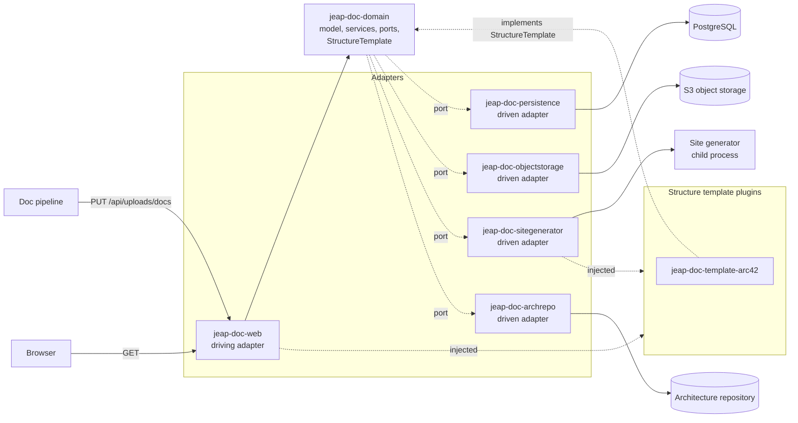

# Architecture

The doc service is built as **ports and adapters** (hexagonal architecture): the domain in the centre holds the
model and the business logic, it declares the *ports* it needs as interfaces, and the technical *adapters* around
it implement those ports or drive the domain through them. The domain therefore depends on no framework detail,
and a technology can be replaced without touching the business logic.

Beside the domain and the adapters there is a third kind of module: a **structure template plugin**. It supplies
a way of structuring documentation - arc42 is the one that ships - and it is neither the centre of the hexagon nor a
technology behind a port. [Structure templates](structure-templates.md) describes it.

## Modules

| Module                      | Role               | Contents                                                                                                              |
|-----------------------------|--------------------|-----------------------------------------------------------------------------------------------------------------------|
| `jeap-doc-domain`           | domain             | The model of the documentation, the services acting on it and the ports it needs - see [its packages](#the-packages-of-the-domain) |
| `jeap-doc-markdown`         | support            | How a page is written: Markdown, front matter, `_category_.json` - **and the escaping**. No dependencies at all       |
| `jeap-doc-template-arc42`   | plugin             | arc42: its twelve chapters, its structural rules, and the pages generated into them from the architecture model       |
| `jeap-doc-persistence`      | driven adapter     | Spring Data JPA on PostgreSQL (the uploads, the builds, the architecture model and what is replicated beside it), and the Flyway migrations |
| `jeap-doc-objectstorage`    | driven adapter     | S3 over the jEAP object storage starter, and the startup check of the bucket                                          |
| `jeap-doc-sitegenerator`    | driven adapter     | Produces the site: the build workspace, what the site template reads, the site template itself, the generator process |
| `jeap-doc-archrepo`         | driven adapter     | The client of the architecture repository's `/docs-api`, behind the three upstream ports of [the import](architecture-import.md) |
| `jeap-doc-metrics`          | driven adapter     | The Micrometer meters behind the `UploadMetrics`, `BuildMetrics` and `ArchitectureImportMetrics` ports, and the `ContainerMemory` reading |
| `jeap-doc-site`             | resources          | The site generator's own application - no Java. Read from the classpath, never from a directory beside the jar        |
| `jeap-doc-web`              | driving adapter    | The Spring Boot application: REST API, OpenAPI, security, and the documentation it serves                             |
| `jeap-doc-service-instance` | packaging          | POM-only module a project depends on to create its own doc service instance                                           |

### The packages of the domain

The domain is the largest module, so it is divided by what a class is about rather than by what it is:

| Package | What is in it |
|---------|----------------|
| `…doc.domain` | The builds and the sites: the runner, the trigger, the schedules, the site configuration and what is published |
| `…doc.domain.upload` | Everything about an upload - the descriptor, the service, the states, the housekeeping. It asks the rest of the domain for one thing: a build |
| `…doc.domain.architecture` | The architecture model as a page needs it: the `Documented…` records and the enums they carry |
| `…doc.domain.architecture.view` | `SystemContext` and `WhiteboxView` - what a diagram of one system shows, computed across the whole landscape |
| `…doc.domain.architecture.imports` | How that model is replicated: the job, its schedule, the four kinds and the step for each, the deadline and the outcome |
| `…doc.domain.port` | Every interface the domain needs from the outside, and the records they answer with |
| `…doc.domain.template` | The `StructureTemplate` plugin point - see [Structure templates](structure-templates.md) |

**`architecture` does not depend on `architecture.imports`, and that is the point of the split.** The records a
page is written from do not know they were replicated, so how the landscape is fetched can change without
touching them - and `Deadline`, `ArchitectureImportStep` and `StoredArchitectureModel` are package-private
because nothing outside the replication has any use for them.

### Rules the modules follow

- **The domain module depends on no adapter module, on no web framework, on no driver - and on no infrastructure
  library.** Everything it needs from the outside is an interface in `ch.admin.bit.jeap.doc.domain.port`. That
  rule is not only about databases: a metrics library, a JSON mapper and a distributed lock are infrastructure
  too, and each of them has a port and an adapter here rather than a dependency in the domain. What the domain
  says is *this build failed*, *only one instance may publish this site*; how that becomes a meter, a lock row
  or a file is decided by an adapter.

  Its `pom.xml` is the check that costs nothing: **a new dependency there needs a reason that is about the
  documentation domain**, not about how something is stored, measured, serialised or coordinated.
- **Serialisation formats belong to whoever reads them.** What the site template reads is written by
  `jeap-doc-sitegenerator`, because the format is a contract between the generator and the template, not a fact
  about documentation.
- **Where Jackson is needed it is Jackson 3** - the `tools.jackson` group and packages, never
  `com.fasterxml.jackson`. Its exceptions are unchecked.
- An adapter module depends on the domain, never on another adapter.
- Each module contributes one auto-configuration (`Doc*Configuration`, registered in
  `META-INF/spring/org.springframework.boot.autoconfigure.AutoConfiguration.imports`), so an instance provides its
  application class and its configuration and gets the wiring.
- New business logic goes into the domain; new technology goes into an adapter. A new adapter kind - an event
  publisher, an HTTP client for another service - becomes its own module.
- **A structure template is a plugin, and a module of its own.** The plugin point `StructureTemplate` is in the
  domain, because the upload validation in the web layer will read the chapters as much as the generator does,
  and that path must not reach the site generator. The structure template itself is in the module.

  A plugin point is not a driven port: a port has exactly one adapter, a plugin point has as many
  implementations as there are templates. **Nothing outside a template module names it** - the site generator
  injects every `StructureTemplate` it finds, and nothing names a template by class. A second structure template
  is a dependency and a bean. See [Structure templates](structure-templates.md).
- **`jeap-doc-markdown` has no dependencies and must keep none.** It is reached from the templates and from the
  site generator, and through the templates it will be on the path of the upload validation - everything added
  to it travels all of that way. The moment it needs the domain it has stopped being a syntax helper.

## Receiving an upload

The path of an upload through the hexagon shows the layering at work: the web adapter binds and authorizes the
request, the domain decides what happens, and the two driven adapters do it.

1. `jeap-doc-web` binds the parameters, checks the semantic role and hands the body to the domain as a stream.
2. `jeap-doc-domain` records the upload through the repository port - **before** the bundle is read - stores the
   bundle through the storage port, and marks the upload as pending afterwards. No transaction is open while the
   bundle streams.
3. `jeap-doc-persistence` keeps the upload in `documentation_upload` and what it documents in
   `documentation_subject`, both with identifiers from a sequence; the identifier of an upload is what its bundle
   is stored under.
4. `jeap-doc-objectstorage` writes the bundle to the bucket, under the prefix of the incoming documentation.

What that means for a pipeline - the states, the retries and what is not checked - is described in
[Uploads](uploads.md).

## Generating and serving the documentation

The other half runs on its own: nothing calls it, and it calls nothing back.

1. Something asks for a site to be published - an upload, or its schedule. Both leave a **request**, at most one
   per site.
2. `jeap-doc-domain` takes the request under a lock named after the site, writes what the site contains into a
   workspace, and hands that workspace to the site generator port.
3. `jeap-doc-sitegenerator` installs the site template **over** that content and runs the generator as a child
   process. The technology - Docusaurus, Node - lives in this module and nowhere else.
4. `jeap-doc-objectstorage` writes the output under the identifier of the build, and **one row** in
   `documentation_build` then makes it the site that is served.
5. `jeap-doc-web` serves that site to a browser, reading the row and the objects.

**Generating and serving are separate, and neither is optional.** They share a database and a bucket and nothing
else: the generator's only output is objects plus a row, and the web server's only input is that row. That is
what keeps a reader's page fast while a build saturates a core, and what lets a build fail without a reader
noticing. What each side does is [Generating the documentation](generation.md).

## What the service provides

- the REST API with its security, its OpenAPI documentation and the endpoint receiving a documentation set,
- the object storage, whose bucket is checked at startup,
- the database connection, the transaction management and Flyway,
- the build, the OSS publication, the dependency updates and the vulnerability scan.

## Related

- [API](api.md)
- [Uploads](uploads.md)
- [Structure templates](structure-templates.md)
- [Generating the documentation](generation.md)
- [Configuration](configuration.md)
- [Security](security.md)
