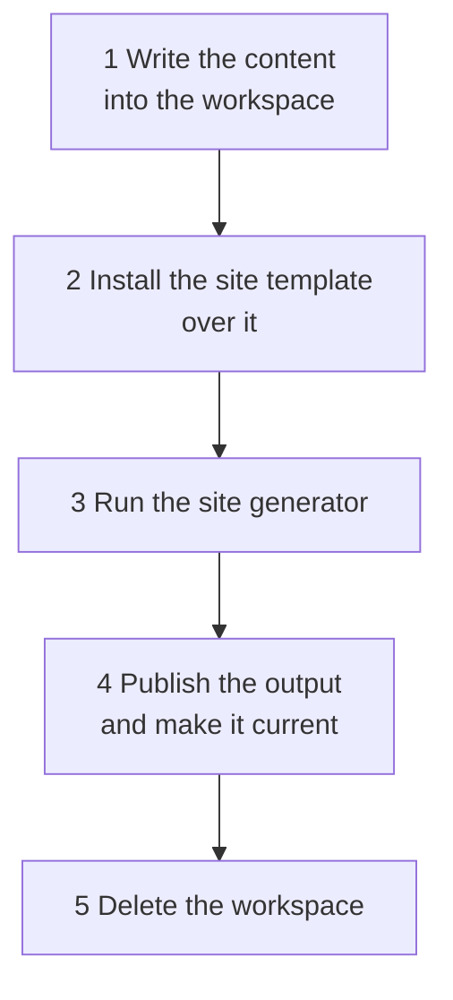

# Generating the documentation

The doc service does not only receive documentation, it publishes it: it runs the site generator over what it
knows, puts the result into the object storage and serves it. This page is about that half - what a build does,
what makes one happen, and what to look at when one does not.

## What a build is

A **documentation site** is one published whole: one navigation, one layout, one search. Which sites exist is
[configuration](configuration.md#documentation-sites); each of them is generated and published on its own, and
each has its own **environments** - trees of the same documentation showing the state of a different stage.

One run of the generator is a **build**, and a build is five steps:

The order of the first two is not a detail. **The content is written first and the site template is copied over
it**, and everything at the top level of the workspace that is neither the content nor the template's own is
removed. The application that runs is therefore the template's, byte for byte and at every depth, whatever was
generated into the content directory - which is what will keep documentation uploaded by a team from being able
to become part of the program that builds the site.

### Search is the environment the reader is in

The environments hold the same pages, so one index over all of them would answer every query with the same page
once per environment and leave the reader to find the tree they are already in. The index is therefore split one
part per environment, and **the search box takes the part from the page it is on** - no setting, nothing to
choose. A reader on the DEV tree searches DEV.

The parts are separate files and a page loads only its own, so it is not a filter over the results: a PROD hit is
not something a DEV page has and hides, it is something it never fetched.

The search page at `/search` is the exception, because it is one page at the site root and cannot take the
environment from its own path. It reads it from the `ctx` query parameter, which the search box puts into the
link it offers, and it carries a selector for changing it.

## What makes a build happen

Three things ask for one, and none of them builds:

|                  |                                                                                                                                   |
|------------------|-------------------------------------------------------------------------------------------------------------------------------------|
| **An upload**    | Documentation was uploaded for a site, and that site is published on upload                                                       |
| **The schedule** | The site's `publication-schedule` came round                                                                                      |
| **An operator**  | Somebody asked over the API - `POST /api/sites/{site}/builds`, see [API](api.md). It ignores `publish-on-upload`: a site published only when something is uploaded to it is exactly the site somebody has to be able to publish by hand |

All three leave the same thing behind: a **request** for that site, at most one at a time. Everything else
follows from that.

### Several triggers are one build

A request that is already pending is left exactly as it is, and the request is taken - cleared - at the *start*
of a build, before anything is read. So every trigger arriving while a build runs finds the flag clear and sets
it again, and **the next run serves all of them at once**. Three uploads during a running build produce exactly
one further build, not three.

### One build of a site at a time

A build holds a lock named after its site, so two instances never build the same site at once - and two
*different* sites are built in parallel, because a site that takes ten minutes must not hold up one that takes
ten seconds. One instance builds one site per cycle: a build is a process that wants a core, and three pending
sites must not become three of them inside one container.

An instance that dies mid-build holds its lock until the lease expires. The next build of that site marks what it
left as `ABANDONED`, which is what turns a row that would otherwise say `RUNNING` for ever into a fact.

## What a build leaves behind

Every run is a row in `documentation_build`, and it is what to read first:

| Column                        |                                                                                                                                   |
|-------------------------------|-----------------------------------------------------------------------------------------------------------------------------------|
| `state`                       | `RUNNING`, `SUCCEEDED`, `FAILED`, `ABANDONED` or `ABORTED`                                                                        |
| `trigger_kind`                | `UPLOAD`, `SCHEDULE`, `MANUAL` or `RECOVERY` - why this run happened                                                              |
| `started_at`, `finished_at`   | when, and for how long                                                                                                            |
| `instance`                    | which instance ran it, for a log search                                                                                           |
| `object_prefix`               | where its output lies                                                                                                             |
| `page_count`, `size_in_bytes` | what it produced                                                                                                                  |
| `docusaurus_millis`           | how much of the run was the site generator itself - the number that says whether a slow build is the generator or the doc service |
| `failure_reason`              | what went wrong, with the last lines of the generator's output when that is what went wrong                                       |

**The published site of a site is its newest `SUCCEEDED` row.** There is no second place saying which site is
served, so there is no second place that can disagree with it.

Old rows are removed nightly, after `jeap.doc.build.history-retention` - **except the published one of each
site**, which is kept whatever its age. A site that is only ever built when something is uploaded to it would
otherwise lose the row that says it is published at all, and start answering that it has never been generated.

## How a site is published without a gap

The object storage has no transaction to borrow, so the design does not ask it for one:

1. the generated files are written under `sites/<site>/<build>/`, a prefix nothing points at yet;
2. **one row** moves the build to `SUCCEEDED` - and that is the publication;
3. only then are the sites past `jeap.doc.build.retention` deleted.

A reader therefore sees the whole previous site or the whole new one, never a mixture and never a gap. A build
that fails, or an instance that dies at any point, leaves the site published before it exactly as it was; the
worst it costs is objects nothing references, which the retention removes on the next run and the bucket's
lifecycle rule removes if there is no next run - see [Operating the bucket](operating-the-bucket.md).

## The build workspace

A build works in `jeap.doc.build.workspace-directory/<build>` and deletes it afterwards. It holds one build's
scratch files and outlives nothing, so **it belongs on storage that belongs to this container alone** - the
writable layer of a task on ECS, an `emptyDir` on Kubernetes.

A process that is killed leaves its workspace behind, so the directory is also swept: **a workspace may be
removed when its build is not running**, whichever instance created it. That one rule is what makes the sweep
safe while other instances are building, and it is why the leftovers of an instance that never comes back are
removed by whichever instance builds next. It runs before every build.

## What a stop does, and what happens when it cannot

A build runs for minutes, so a deployment lands on one sooner or later. Two things make that survivable, and
they are worth telling apart: **one makes it quiet, the other makes it correct.**

### The stop itself

An instance being stopped destroys the site generator and records what it was doing, before the context destroys
its beans and takes the connection pool with them. It happens in this order, each step on its own and none of
them able to stop the next:

1. **The build is recorded as `ABORTED`** - not `FAILED`. Nothing about the generator is wrong, and the alarm is
   on failures, so a deployment must not page anybody. The meter says `result="aborted"`.
2. **The site's lock is given back**, so another instance may build it at once rather than after the lease.
3. **The build is asked for again**, so it runs within a poll interval instead of waiting for the next upload or
   schedule. The trigger it carried is the one restored.
4. **What it had already uploaded is removed.** Those objects are referenced by nothing - the retention only
   deletes what a *successful* build published - so the bucket's lifecycle rule is what removes them if this
   step does not get to run.

The whole of it is bounded by `jeap.doc.build.shutdown-timeout` (15 seconds), which is a hard limit rather than
a target: overrunning `spring.lifecycle.timeout-per-shutdown-phase` would let the context destroy the connection
pool while the build thread is still writing, which is the state this exists to avoid.

### The stop timeout of the platform

`spring.lifecycle.timeout-per-shutdown-phase` applies **per phase**, and this service has three that can wait -
the web server's graceful stop, the build's, and the scheduler's. At the default of 20 seconds the worst case is
therefore about a minute, and **the platform's stop timeout has to be above it**:

|            |                                                                                                                                   |
|------------|-----------------------------------------------------------------------------------------------------------------------------------|
| ECS        | `stopTimeout` on the task definition, **90** seconds. The default is 30, which lands inside the shutdown and turns it into a kill |
| Kubernetes | `terminationGracePeriodSeconds`, likewise 90                                                                                      |

### When it cannot record anything

A container that is killed outright - `stopTimeout` too short, an out-of-memory kill, a host failure - writes
nothing at all. **The recovery does not depend on it.** What is left behind is a build still marked as `RUNNING`,
and that row is itself the evidence that a build is owed:

- its site's lock is leased for `jeap.doc.build.lock-lease` (2 minutes) and extended in the background only
  while an instance is alive to extend it, so the lock frees itself two minutes after the instance dies;
- the next instance to poll takes that lock, marks the run `ABANDONED`, counts `jeap.doc.build.abandoned`, and
  **builds the site again as `RECOVERY`** - the request cannot say a build is owed, because it was claimed when
  the build started, so the row says it instead;
- its workspace is swept, because a build that is not running no longer protects its directory.

So a killed instance costs a site about two and a half minutes and one `abandoned` count. A build that was
itself a `RECOVERY` and is lost again is **not** retried a second time: one automatic attempt is a crashed
instance, two in a row is a build that kills whatever runs it, and repeating it would be a crash loop.

## When something is wrong

|                                               |                                                                                                                                                                                                         |
|-----------------------------------------------|---------------------------------------------------------------------------------------------------------------------------------------------------------------------------------------------------------|
| **The site is not updating**                  | `GET /api/sites` answers it: the schedule, whether it is published on upload, what is pending, what is running and what was last built. A site with no `publication-schedule` is published only when something is uploaded to it |
| **Builds are failing**                        | `documentation_build.failure_reason` carries the last lines of the generator's output. `jeap_doc_build_seconds_count{result="failed"}` is the counter                                                   |
| **A build hangs**                             | It is given up on after `jeap.doc.build.timeout` and the process tree is killed. If that happens repeatedly, look at the memory the container has - see [The site image](site-image.md)                 |
| **`GET /` answers 503**                       | Nothing has been published for that site yet. It is not a wrong URL: the first successful build answers it                                                                                              |
| **Nothing is picked up at all**               | `jeap_doc_build_request_age_seconds` grows. Either no instance is running the schedule, or a lock is held by an instance that has gone - which resolves itself within `jeap.doc.build.lock-lease`       |
| **`jeap.doc.build.abandoned` keeps counting** | Containers are being killed rather than stopped. Check the platform's stop timeout against the budget above, and the memory the container has                                                           |
| **A site stopped rebuilding after a crash**   | Look for a build with `trigger_kind = RECOVERY` and state `ABANDONED`: the automatic retry was used up, which means the build kills the instance running it. It waits for an upload, its schedule, or a `POST /api/sites/{site}/builds` |

What to alarm on, and the rest of the meters, is [Observability](observability.md).

## Related

- [Configuration](configuration.md) - the sites, their environments and the build
- [Observability](observability.md) - the meters and what to alarm on
- [The site image](site-image.md) - how an image with the site generator is built
- [Operating the bucket](operating-the-bucket.md) - what has to expire and what must not
- [Uploads](uploads.md) - what happens before a build
