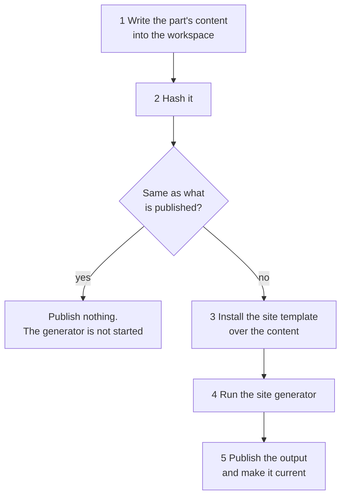

# Generating the documentation

The doc service does not only receive documentation, it publishes it: it runs the site generator over what it
knows, puts the result into the object storage and serves it. This page is about that half - what a build does,
what makes one happen, and what to look at when one does not.

## What a build is

A **documentation site** is one published whole: one navigation and one layout. Which sites exist is
[configuration](configuration.md#documentation-sites); each of them has its own **environments** - trees of the
same documentation showing the state of a different stage.

**A site is not one build any more.** It is published as several, one per **part**, because one build of a whole
landscape stopped fitting: the memory a build needs grows with the pages it produces, and a site of eighteen
thousand pages needs more of it than any container is given. So the site is cut up, and the doc service serves
the pieces as one site.

| | |
|---|---|
| A **part** | What is generated, published and served as a unit: a set of whole URL subtrees of the site |
| The **shell** part | The site's own pages - the root page of each environment, the systems index, the page about the documentation - and whatever no other part claims |
| A **system** part | One system, in every environment of the site: `/systems/orders/`, `/dev/systems/orders/`, and so on |

A part is a whole URL subtree and not an arbitrary set of pages, and that is not a preference: a Docusaurus
build puts everything it emits under its own base URL, so a request has to resolve to exactly one part. The
files every part emits identically - the bundles under `assets/` and the site's own images under `img/` - are
published once for the whole site and served from there.

One run of the generator is a **build of one part**, and it is five steps:



**The hash is what makes a part per system affordable.** Writing a part's content is a fraction of a second and
generating its site is minutes, so the cheap half decides whether the expensive half runs at all. What is
hashed is the content itself - not the model it came from - so whatever a page is made of is covered: the
architecture model, a replicated artifact, an uploaded document, a generator that writes something differently,
a new version of the doc service. What is taken out of the hash first is the run's own timestamps and its build
identifier, or two runs over documentation nobody changed would differ.

Those three are **provenance**: they say *this content is as of then*, which stays true for a part that is not
built again. Nothing else about a run is written into a page. Anything that would go stale in a page nobody
rebuilds - when the architecture repository was last read, whether the import is behind, when the schedule
fires next - is not generated at all but answered live, and fetched by the page that shows it. That is the rule
to follow when adding something a page says about the service: **provenance goes in the page and into the
volatile set; status is served beside the site.** Hiding a status value from the hash instead would freeze the
page that is meant to report a broken import, which is the one page that has to keep working when one breaks.

The order of steps 3 and 4 is not a detail either. **The content is written first and the site template is
copied over it**, and everything at the top level of the workspace that is neither the content nor the
template's own is removed. The application that runs is therefore the template's, byte for byte and at every
depth, whatever was generated into the content directory - which is what will keep documentation uploaded by a
team from being able to become part of the program that builds the site.

### What a part cannot check

Docusaurus checks every link against the routes of **its own** build, and the doc service builds it with
`onBrokenLinks: 'throw'` - which is what catches a generator bug. A link into another part is not one of those
routes, so it is written as `pathname://`, which renders a plain anchor and leaves the check. Inside a part the
check is exactly as strict as it was.

That is why a part per system carries **every environment of its system**: a page that exists on `dev` and not
on `prod` is the shape a generator bug takes, and keeping a system's trees in one build keeps that check.

## What is in a build

Two kinds of documentation end up on one site. A page is one or the other, never both.

|               |                                                                                                                                                                                                       |
|---------------|-------------------------------------------------------------------------------------------------------------------------------------------------------------------------------------------------------|
| **Generated** | Written by the doc service from the architecture model of the environment being built: what the systems are, who owns them, how they are decomposed, what they exchange. Rewritten whole on every run |
| **Custom**    | Written by the team that owns a system, next to its code, and uploaded by its pipeline. The generator never writes those pages and never reads them                                                   |

A generated page says so. Its front matter carries `doc_status: generated` and where the content came from, and
its foot names the environment it was generated from and when - when the model was imported and when the page
was built. A page that would be half generated is two pages instead.

### The structure template

Where a page is served follows from the **structure template** the documentation is organised by. The doc
service ships [arc42](https://arc42.org). A further structure template is a further module - see
[Structure templates](structure-templates.md) for what a template is and how to add one. The layout below is
what arc42 produces:

```text
/systems/                                                              every system, with its team
/systems/orders/                                                          what the system is, and its structures
/systems/orders/system-architecture/                                      arc42 for the system
/systems/orders/system-architecture/intro/                                1. Introduction and Goals
/systems/orders/system-architecture/context-and-scope/                    3. Context and Scope
/systems/orders/system-architecture/context-and-scope/system-context-view/
/systems/orders/system-architecture/building-block-view/                  5. Building Block View
/systems/orders/system-architecture/building-block-view/whitebox-view/
/systems/orders/system-architecture/building-block-view/components/orders-foo-bar-service/
/systems/orders/system-architecture/building-block-view/events/orders-payment-accepted-event/
/systems/orders/system-architecture/building-block-view/commands/orders-check-availability-command/
/systems/orders/system-architecture/runtime-view/                         6. Runtime View
```

**A component carries the same structure one level down**, below its own page and under a segment named for
what it describes there:

```text
.../components/orders-foo-bar-service/                                    the component, in the system's tree
.../components/orders-foo-bar-service/component-architecture/             arc42 for the component
.../component-architecture/intro/                                         1. Introduction and Goals
.../component-architecture/context-and-scope/                             3. Context and Scope
.../component-architecture/context-and-scope/context-view/                the component context view
.../component-architecture/building-block-view/                           5. Building Block View
.../component-architecture/building-block-view/database-schema/           the entity relationship diagram
.../component-architecture/building-block-view/rest-api/                  the API by group, and the Swagger link
.../component-architecture/building-block-view/messages/                  what it produces and consumes
.../component-architecture/runtime-view/                                  6. Runtime View
```

Four rules follow, and an upload has to keep the first three too:

- **The chapter folder carries its arc42 number, the URL does not.** A chapter is the folder
  `5-building-block-view`, is served at `/building-block-view/`, and reads as *5. Building Block View* in the
  navigation. Links then survive a renumbering. A relative Markdown link between two pages of a repository
  still resolves once they are published.
- **A chapter with nothing in it does not exist.** The generator creates the four it has something to say
  about. A gap in the numbering means a chapter has not been written, not that it is empty.
- **A component lives inside the building block view.** A component is one of the blocks, so its documentation
  sits where the decomposition is described, next to the events and commands that flow between them. Its own
  chapters hang below its page, and the page links to them.
- **A message is documented under its name, kebab-cased.** `OrdersPaymentAcceptedEvent` is served at
  `.../events/orders-payment-accepted-event/`. Every message of the model gets its page: the segment is derived
  and checked by [the import](architecture-import.md#every-name-becomes-a-slug), which refuses a name that
  yields none, one that would be the listing of its group, and two that yield the same - so no page can be
  written over another. The building block view links to a group of messages only when the system defines
  one of that kind.

### The diagrams

A diagram is **fenced source, never an image**: the page carries the PlantUML and the site's plugin renders it
in the reader's browser, so a diagram stays searchable, diffable and readable as text. Nothing generates a
`.png` or an `.svg`.

Four pages carry one:

- **The system context view**, in *3. Context and Scope*, draws the system in the middle and every other system
  it exchanges something with around it. It is laid out **left to right**, because a star of two ranks is a
  narrow column that way and a wide ribbon the other way.
- **The level-1 whitebox view**, in *5. Building Block View*, carries **two** diagrams of the same system:
  *Inside the system* - its components and what flows between them, and nothing else - and then *With the
  neighbouring systems*, which adds every other system as a single box. The first is the one to read for a large
  system; the second says where it sits in the landscape. Both are laid out **top to bottom**, which is where
  the ranks of a graph of components calling components belong.

- **The component context view**, in a component's own *3. Context and Scope*, draws that component in the
  middle of its system's package and, beside it, **every counterpart it exchanges something with as its own
  box** - the siblings inside its own system's package, the components of other systems inside a package for
  the system that owns each. Only the counterparts it exchanges something with: drawing all of a system's
  components would make the page that system's whitebox view. **A package is not a decomposition**, and the
  page says so: it holds the counterparts, never everything the neighbour has.

  A neighbouring system is **one box** in two cases - the architecture model names no counterpart component
  for it, or the bound on the boxes left no room to open it. An arrow then lands on that box, and two
  relations to different components of that system are one arrow carrying both sets of labels. Where the model
  names a component but not the system that owns it, the diagram has no box for it at all - a box outside
  every system would read as a component of no system - and the page names those separately, because their
  relations are on its table with nothing in the picture.

  Every box links to its own page, and so does every package: opening a neighbour must not cost the reader the
  way into that neighbour's own documentation. It is laid out **left to right**, because its shape is the
  context view's.
- **The entity relationship diagram**, in a component's *5. Building Block View*, draws an entity per table of
  the database schema its build published - the primary key columns above a separator, `*` for a column that
  cannot be null, `<<PK>>` and `<<FK>>` markers, and one arrow per foreign key.

The whitebox page draws *Inside the system* only when the components of the system actually exchange something.
Otherwise the two diagrams would be the same boxes twice. A component that exchanges nothing gets no context
diagram either: its page says the architecture model records no relation, which is a fact worth reading, and an
empty box is not.

**An arrow is labelled with what travels along it, up to a limit.** Above
[`max-edge-labels`](configuration.md#the-architecture-model) names, the arrow shows the count for its kind
instead - `5 Events`, `6 Commands`, `3 REST Calls` - and the page says so in a note. The names are never lost:
the **Relations** table of the whitebox page and the **Neighbours** table of the context view list every
relation with everything travelling along it, each linked to its message page where the system defines the
message.

The cap is not a matter of taste. The diagram engine lays a label out by recursion and overflows the browser's
stack at about sixty lines, and a diagram that fails to render is an error box on the page that fails no build -
so an arrow of a busy system has to be summarized for the diagram to exist at all.

### What the colours mean

Two, and no more: the box of the **subject** - the current system on a system context view, the current
component on a component context view - is **gold** and outlined bold, and every **relation** of a component
diagram is **blue**. The entity relationship diagram keeps its black crow's feet, which are data-model
notation rather than relations.

**The colours are the same in either colour mode**, and that is a decision rather than an oversight. The site's
diagram plugin re-renders a diagram with the engine's dark palette when a reader switches, which moves
PlantUML's *own* fills and strokes - but never a colour written into the diagram's source. These two are
written into the source, because the subject is the subject and a relation is a relation in either mode.

The same holds for the boxes: above [`max-diagram-nodes`](configuration.md#the-architecture-model) other
systems, a diagram leaves the rest out and says how many. A system's own components are never left out of the
whitebox view - every one of them has a page, and one missing from it would be a page no diagram points at.

A component's context view is bounded the same way, by
[`max-context-components`](configuration.md#the-architecture-model) component boxes - its siblings and the
counterpart components of other systems together - and `max-diagram-nodes` other systems. The siblings are
drawn first and then one component of each other system in turn, so one large neighbour cannot push a
component's own siblings off its own page; a system whose components got no box is drawn as a single box, which
is what the whole view was before it named foreign components. And an entity relationship diagram is bounded by
[`max-schema-table-diagram`](configuration.md#the-architecture-model) tables: the tables something has a
foreign key into are kept first, so the arrows of the tables that are drawn still point at a box. A schema of
three hundred tables gives a reader a page that is useful rather than one that fails to render.

These bounds are on the picture and not on the facts. A diagram that had to leave something out says how much,
and the list of tables below it carries what it left out - up to
[`max-schema-table-list`](configuration.md#the-architecture-model) entries. That is the one bound on the facts
themselves, and [Tables of one name pattern are grouped, and the list is bounded](#tables-of-one-name-pattern-are-grouped-and-the-list-is-bounded)
is what it is for.

### Where the generated content comes from

The doc service **imports** the architecture model of each environment from its
[architecture repository](configuration.md#the-architecture-model), on a schedule of its own, and a build reads
what was imported. A generation run makes no call to the architecture repository at all, so a repository that
is being deployed cannot fail a documentation build - see [the import](architecture-import.md).

What a page shows is therefore the landscape as one import stored it, and every generated page says which
import that was, next to when the page itself was built. **The two are read together, out of one snapshot of the
database**, so a page never names an import its content did not come from - and an import that commits while a
build is reading can neither tear the landscape nor change it under the build. What the build generates from is
the model as it stood when the build started.

Note that the timestamp on a page is not the same thing as the staleness warning in the log. The page names the
import its content came from; the warning names how long ago the architecture repository was last read
successfully, which is what says whether the import is still working. A landscape nobody has changed for a
month is not stale - every import in between read it and wrote nothing.

An environment with no architecture repository is a legitimate configuration. Its tree carries the root page and
whatever was uploaded into it, and no build fails over it.

A site may say that it needs the model before it is published, with
`jeap.doc.sites.<site>.architecture-model-required` - the default. Such a site is **not published until its
model has been imported once**: the build is postponed rather than failed, so its request stays standing and
the next poll tries again. The only window this covers is the one between an instance starting and its first
import finishing.

### What a message page shows

A message type gets a page of its own under the building block view of the system that defines it: what it is,
its topic and scope, the contracts on it - and its **versions**, as a table of what exists.

Where the [message schemas](architecture-import.md#the-message-schemas-asked-about-every-run-fetched-only-when-they-move) have
been replicated, that table names each version's key and value schema and links them into the message type
registry, says what the version is compatible with, and a section under it carries each schema in full.

The schema is fenced as `java`, which it is not. What is stored is the architecture repository's **rendering** -
every `import idl` inlined, the base types dropped, the namespaces and the enclosing braces removed - and it is
deliberately not valid Avro IDL. There is no language that highlights it correctly, and Java is close enough to
read while being wrong enough that nobody mistakes it for the file; the link beside it is where the file is.

A version whose schemas were never replicated - a new one, or one a run missed at its deadline - keeps its row
in the table and simply has no section. A replication that is behind never costs a page.

### What a component's pages show

A component already has a page in the tree of its system - its identity card, where a reader finds it in the
decomposition. Below that page it carries its own arc42 tree, with the four chapters the generator writes
into. **Which of them exist depends on what the architecture repository knows about the component**: 1, 3 and 6
can always be written, and 5 appears when there is a database schema, a REST API or a message contract to put
in it. A component the architecture repository knows only the name of gets three chapters and no empty folder.

| Page                        | What it shows                                                                                                                                                                                                              |
|-----------------------------|----------------------------------------------------------------------------------------------------------------------------------------------------------------------------------------------------------------------------|
| *1. Introduction and Goals* | What the component is, its type, the team that owns it with their contact address, the system it belongs to, the importer that knows it and when it was last seen. It repeats the facts of the component's page in the system's tree deliberately: a reader who followed a link into the subtree should not have to go back out for the owner's name |
| *Component Context View*    | The diagram above, and the table of **every** relation with its counterpart, kind and label                                                                                                                                |
| *Database Schema*           | The entity relationship diagram, the database name and schema version, and the list of every table with its columns, their types, whether they may be null and which keys they belong to                                    |
| *REST API*                  | The specification version, where the API is served, the count of operations, the **deep link into the Swagger UI of the architecture repository** - and a table per API group, with each operation's method, path and summary |
| *Messages*                  | What the component produces and what it consumes, with the defining system, the topic and the versions under contract, each message **linked into the tree of the system that defines it** - which is not always the component's own                                                     |
| *Component Reactions*       | Written and empty on purpose: the reactions are observed at runtime and that import is not published yet, so the page says what it is waiting for                                                                          |

**The REST API page is an overview and a link, not a rendered specification.** A rendered specification is a
second Swagger UI, badly, and there is a real one to link to. The groups come from the tags of the replicated
specification; the architecture repository keeps no tag of its own, so a component whose specification has not
been replicated gets its operations from the model instead, ungrouped, and the page says why. **The page is
written either way** - a component with endpoints and no replicated specification is exactly the case a reader
wants to see.

A tag the specification declares and no operation uses is not a group: it would be an empty table promising a
part of the API that is not there. An operation with several tags appears once, under the first.

**A message is documented once**, on the page of the system that defines it. A component's *Messages* page
links to it rather than repeating it.

**And the message need not be its own system's.** A contract is recorded on the message, so a component
consuming another system's event has that contract on nothing of its own system at all - which is the ordinary
case in a landscape that exchanges events. The page therefore resolves contracts across the whole imported
model, names the defining system in a column of its own, and links into that system's tree; where that is
another part of the site the link leaves this build's broken-link check and is rewritten to an absolute URL.
A component whose every contract is on other systems' messages gets the page all the same.

**A contract is matched on the system and the component, not on the component alone.** A component name is
unique within its system and nowhere else - two systems each having a `gateway` is ordinary - so the system is
part of the join. Where the model does not say which system a contract's component belongs to, the name is all
there is and is matched on its own.

**The REST API page describes the component's own operations and not the platform's.**
[`rest-api-excluded-paths`](configuration.md#the-architecture-model) leaves out what matches it, and its
default is the actuator - every jEAP service publishes the operational endpoints the platform needs, and on a
small service they outnumber the operations a reader came for. A group the exclusions empty is gone rather
than a heading over an empty table, the count in the facts row is what the page documents, and the page says
how many operations it left out so that the count can be compared with the specification. It applies to the
fallback list from the architecture model too: what a reader is not shown must not depend on whether the
specification has been replicated yet.

**The Database Schema page is written as soon as the model says the component has one**, replicated or not, for
the reason the REST API page is: between an architecture import and the replication of the schema there would
otherwise be no entry in the chapter at all, and no way to tell a schema that has not arrived yet from a
component that keeps no data. Until it arrives the page carries the schema version the model knows and says
that there is no diagram yet and that the next import brings one.

Two tables of a database schema are on neither the diagram nor the list: **`flyway_schema_history` and
`shedlock`**, matched ignoring case, are the machinery of a schema rather than the data of the component. The
page names the ones it left out, because a silently incomplete diagram is worse than one short sentence. The
two names are the jEAP conventions - the Flyway history table of `jeap-spring-boot-db-migration-starter` and
ShedLock's own - and they are matched **by name and not by role**: a component that renamed its Flyway history
table keeps it on the diagram, and one that owns a table of its own called `shedlock` does not get it
documented.

An artifact that cannot be read - bytes that are not JSON, a truncated document - costs its own page and
nothing else. The reason is logged with the component's name, and the page falls back to what the model knows.
There is no `try` around the generation of a site, so a malformed specification that threw would end the
documentation of every system of the environment.

#### Tables of one name pattern are grouped, and the list is bounded

**A partitioned table is documented once.** A component that partitions by day or by tenant publishes a table
per partition: one schema in the estate holds 6583 tables, of which 6321 are partitions of 260. Those are
grouped into one entry per table, named after the shared part of the name with a **`_*` postfix** -
`doc_meta_*` - and each such entry says how many tables it stands for and what their range is. Nothing is
dropped: the facts row keeps both numbers, as `6583 (260 documented entries)`, and a note on the page explains
the postfix.

**The page says what was observed rather than what it means.** The grouping reads a name pattern and compares
columns and primary keys, and a published schema says nothing about what a table is for - so the entry reads
*these tables share this name pattern and this shape*, not *these are partitions of one table*. Tables kept
deliberately apart, one per year or per version, look exactly alike to it, and the count and the range are what
let a reader check.

A family is recognised by two signals, and the second is what makes the first safe:

| signal | what it is |
| ------ | ----------- |
| the stem | the name without its last segment, where that segment looks like a partition key - `_202609`, `_20260904`, `_54`, `_ym110` |
| the column signature | the ordered columns with their types and nullability, and the primary key. Shards of one table are identical, because the database generated them from one definition. The **foreign keys are deliberately not compared**: a hand-sharded child table often carries a reference per shard, and the entry that stands for the family shows the arrows of one shard |

**Five tables of one stem make a family**, and a stem whose tables do not all share their columns and their
primary key is left alone entirely. That is deliberate: an `order_v1` beside an `order_v2` whose columns differ are two tables,
and a reader shown one row would never learn it. Nothing here infers what a table is *for* - PostgreSQL knows
the answer properly in `pg_inherits`, and the day the schema publisher passes it on this heuristic goes away.

**Grouping happens before either bound applies**, which is what turns both bounds into a formality for all but
two schemas in the estate. Then:

- the **list** writes the first `max-schema-table-list` entries (**200**) by name, with their columns,
- the **diagram** draws `max-schema-table-diagram` of *those* (**100**) by priority - out of the listed
  entries, so a box on the diagram always has a list entry to look it up in, and the diagram is bounded by
  the smaller of the two limits.

Each bound says so on the page, and each says only what it did: the diagram's note counts against the entries
the page **lists**, because the diagram draws out of those - a page whose list is bounded shows fewer boxes
without the diagram's own bound being anywhere near, and the note that named the renderer for that would name
the wrong cause. Where the diagram drew every listed entry there is no diagram note at all, and the list note
carries the rest.

`max-schema-table-list` is the one bound on the facts rather than on a picture, and it is what makes a schema
page's cost finite: unbounded, one component's page carried 33 527 rows of columns and cost an hour and a half
to build. Where it applies the page says how many entries it did not write, and it **links nothing**: the only
other place that carries every entry is the architecture repository's own API, which is not a page a reader of
a published site can open. In the measured estate two components' pages are shortened, by about 60 and 54
entries - and after grouping, those entries share a name pattern with tables that are already on the page.

### What the navigation shows

**A system's sidebar starts open down to the pages of a chapter.** The structure root, the twelve arc42
chapters, the building block view's components and its message groups are expanded; a component's own arc42
tree inside them is not. Collapsed, the sidebar was twelve chapter names and said nothing about what is
documented - and a system of thirty components expanded to every page of each of them is the opposite
mistake.

**The root page's sidebar lists the systems.** Each of them is built as a part of its own, so their pages are
in no tree the shell's build can see: the generator names them in `environments.json` and the site template
hangs one link per system under the systems index. The category is found by a custom property in its
`_category_.json` rather than by its label.

**A link into another part stays in the reader's tab.** Such a link is rewritten to `pathname://` so that it
escapes the build's broken-link check, and Docusaurus reads any protocol as "not this site" - which made every
one of them open a new tab. The template passes `target="_self"` for those hrefs, in
`src/theme/MDXComponents/A` for a Markdown link, in `src/theme/DocSidebarItem/Link` for a part's way out, and
in the configuration for the footer and the navbar logo. Links inside a diagram were never affected: they are
written absolute and rendered by PlantUML, which navigates the top-level context.

### The page that describes the documentation

Every environment tree carries an **About This Documentation** page, at `/about-this-documentation/`, linked
from the root page and from the footer. It answers what a reader of a published site cannot otherwise find out:
what they are looking at, where it came from, and when it changes next.

| Section                         | What it says                                                                                                                                                | Where it comes from                                   |
|---------------------------------|-------------------------------------------------------------------------------------------------------------------------------------------------------------|-------------------------------------------------------|
| What this is                    | The site, the tree, the documentation structures this instance generates, whether an upload publishes the site, whether it waits for the architecture model | The configuration, through `DocumentationProvenance`  |
| The publication you are reading | Which build produced this site and when - and the numbers of that run, fetched                                                                              | The build itself, and `about-this-documentation.json` |
| The environments of this site   | Per environment: which tree it is, what its model contributed, when that content was imported - and, fetched, when the repository was last read             | The run, and `live-status.json`                       |
| When this changes               | The import schedule - it is what publishes the site, so there is only one - and, fetched, when it fires next                                                | The configuration, and `live-status.json`             |

**One page per tree rather than one per site**, which is forced rather than chosen: the site template switches
Docusaurus' pages plugin off, so a page outside the environment trees cannot be served - and a single page in
the main tree would be linked from the others as `/about-this-documentation/`, which the environment-links
plugin prefixes with the reader's tree, giving a route nothing wrote and a build that fails on a broken link.

#### The numbers of the run, and why they are fetched

A page cannot describe the build that writes it. The pages, the bytes and the duration are known when the
generator has finished; the page was written at the start of the same run. Printing the previous
publication's numbers instead would print numbers that are not the reader's.

So the run writes them **at the seam** - after the generator, before the upload, while the site is still on
local disk:

```text
generate()                                 the content, the template, Docusaurus
  └─ pageCount, sizeInBytes, generatorMillis         ◀ the numbers exist here
describeRun(...)  ──▶  about-this-documentation.json  ◀ written into the output
publish(prefix, directory)                            the upload
```

The page links that file absolutely and a client module of the site template fetches it, takes **only its
path** so the request is same-origin whatever `jeap.doc.publication.url` says, and fills a table in after the
heading. Everything about it degrades quietly: a reader with no scripts, an older publication without the file
and a fetch that fails all get the page as written, which is why the sentence under that heading names the file
rather than relying on the table appearing.

#### What is true only now, and why it is fetched too

The same problem one step further along. A part whose documentation has not moved is not generated again - that
is what the content hash is for - so its pages keep the words the last build wrote. For provenance that is the
truthful reading. For **status** it is a lie that nobody can correct, and the sharpest case is the one that
matters most: an import that stops running would leave the page claiming *last read 09:45* for as long as
nobody changed a document, because the page that would report the failure is the page that stopped being
rebuilt.

So three statements are not written into the page at all:

| Not on the page                                        | Where it comes from |
|--------------------------------------------------------|---------------------|
| `Last read`, per environment, and whether it is behind | `live-status.json`  |
| The judgement beside it - *not read since*             | `live-status.json`  |
| The `Next` cell of the schedule table                  | `live-status.json`  |

`GET <base URL of the site>live-status.json` answers them for the whole site in one request - every
environment, and every schedule the page tabulates - so one fetch fills both tables. It is a path of the site
and is therefore served to anyone who can read the site, exactly as the page is; the administration API below
`/api` is a different resource with a different rule, and what may be published is decided in
`DocumentationProvenance` for both. It is answered `no-store`: a cached copy would be the frozen page again
with an extra step.

The page keeps its cells and names the resource in a sentence beside them, so a reader whose browser runs no
scripts is told where the state is rather than shown a timestamp nobody keeps true. The client module finds the
resource through that link, uses only its path, and inserts nothing when the fetch fails - the same three
choices as the numbers of the run above.

### There is no search on the site

The site ships **no search**. It had one - an index built into every environment tree at build time - and it
came out again: the index is built from the pages of one build, so a site published as several builds gets one
index per build and a reader searching in one part would find only that part.

A search over the whole documentation is a separate piece of work, and it will not be a plugin of the
generator: the doc service has the text of every page it writes, so an index it serves itself is what can span
the parts. Until then a reader navigates by the sidebar and the index pages.

### And there is no sitemap

For the same reason, one step further along. The sitemap plugin writes `sitemap.xml` at the root of the build
that ran, so a site published as several builds emitted one sitemap per part - and only the shell's is at a
path anything requests, naming the environment root pages, the systems index and the about pages, and none of
the documentation. A sitemap that claims to be the site's and lists none of its content is worse than none.

What would be right is a **sitemap index** the shell writes from what the other parts emitted. That is the
doc service's to write rather than the generator's, like the search, and it is not worth the machinery for a
crawler hint on documentation nobody crawls.

## What makes a build happen

Everything that wants documentation rebuilt asks for a **part** of a site, and none of them builds:

|                       | Which part |
|-----------------------|------------|
| **An upload**         | The part that carries the system the documents are for. An upload names a system and no environment at all, and with a part per system it does not have to |
| **The architecture import** | **Every part** of every site documenting the environment it read, when it stored a *changed* landscape - see below. `jeap.doc.build.triggered` is how many parts that was |
| **An operator**       | The part they named, or every part of the site - `POST /api/sites/{site}/builds`, see [API](api.md). It ignores `publish-on-upload`: a site published only when something is uploaded to it is exactly the site somebody has to be able to publish by hand |

All of them leave the same thing behind: a **request** for that part, at most one at a time. Everything else
follows from that.

A trigger also asks its own instance to look **now** rather than at its next poll, because that instance
already knows there is work - see [the pass](#how-an-instance-builds-a-pass). The other instances find out
when they poll.

**A trigger that asks for every part names a publication**, and every one of those requests carries its
identifier. That is what makes the wall clock of a full publication measurable: its parts are built across the
instances, so no single one of them knows when the last of them finished - see
[Observability](observability.md#the-publication-start-to-finish). An upload names no publication: it asks for
one part, and one part is not a publication.

### The import is what publishes a site

There is no publication schedule. The architecture import runs hourly at a quarter to, and when it stored a
landscape it asks for every part of every site documenting that environment - so the sites are published
hourly, from a landscape that is minutes old, on one schedule rather than two that could disagree.

**Which systems of that landscape moved is not asked.** A part is one system, and a part whose content has not
moved is not generated: the build writes the content, hashes it, finds the hash it already published and stops
there. So the price of not knowing is the content of every part - two seconds for a landscape of 19,000 pages,
measured - and never a site rebuilt.

A run that finds the landscape it already had asks for nothing at all: the whole landscape is compared by one
hash before anything is written, and an unchanged one is not even stored. So an hour in which nothing changed
costs one HTTP conversation with the architecture repository and no build.

**A site no import publishes is reconciled on a schedule of its own.** A site whose environments have no
architecture repository behind them is asked for by no import, so its only other triggers are an upload and an
operator - and because the content digest covers the service version, it would keep serving what an earlier
release generated. `jeap.doc.build.reconcile-cron` asks for every part of exactly those sites, every four
hours through the working day by default, and `-` switches it off. It is nearly free: a part whose content has
not moved is not generated. Those builds carry the trigger `SCHEDULE`.

**Only the model step asks for a publication.** The OpenAPI specifications, the database schemas and the
message schemas are replicated by steps of their own, and none of them asks for a build. A component that
publishes a new specification while its architecture model stays the same therefore gets the rewritten page
with the next import that changes the model, or when an operator asks for the part by hand.

The landscape is stored either way: asking for the documentation happens after the import has written it, so a
trigger that fails costs an hour - the next import publishes it - and never the landscape.

A site no architecture repository feeds is published when something is uploaded to it, and by an operator.

### Several triggers are one build

A request that is already pending is left exactly as it is, and the request is taken - cleared - at the *start*
of a build, before anything is read. So every trigger arriving while a build runs finds the flag clear and sets
it again, and **the next run serves all of them at once**. Three uploads for one system during a running build
produce exactly one further build, not three.

And a build that is asked for twice over is cheap the second time: the content is written, hashed, found to be
what is already published, and the site generator is never started. That is a `SKIPPED` row, and the number of
them is the meter that says the split is doing what it is for.

### One build of a part at a time

A build holds a lock named after its part, so two instances never build the same part at once - and two
*different* parts are built in parallel, because a system that takes a minute must not hold up one that takes
ten seconds.

An instance that dies mid-build holds its lock until the lease expires. The next build of that part marks what
it left as `ABANDONED`, which is what turns a row that would otherwise say `RUNNING` for ever into a fact.

### How an instance builds: a pass

An instance does not build one part per poll. It builds in a **pass**: it fills its
`jeap.doc.build.max-concurrent-parts` slots from what is owed, and **refills the slot of a part that is done at
once**, until nothing is left that it can build.

That is not a detail of the implementation, it is most of what a full publication costs. Before it, a poll took
the first three parts, waited for the slowest of them, and returned - so the other slots stood empty for the
tail of every batch, and then the poll interval passed with nothing running at all. On a landscape of fifty
parts that was about half the wall clock.

Four things about a pass:

- **What is owed is read again after every build.** A pass over a whole landscape lasts minutes - one on
  ApplicationPlatform dev lasted an hour and 58 minutes - and an upload arriving in the middle of one is
  served by that pass rather than by the next. **That holds for a part the pass has already built**: it is
  offered again, and built again, when a request arrives after the pass last offered it.
- **A part is otherwise offered once per pass.** Held by another instance, or a build that threw where nothing
  should - neither is looked at again until the next pass. Going back to another instance's part is the spin
  the rule exists to prevent, and re-running a build that threw inside the same pass is a retry loop.

  It cannot spin, and that is a property of the data rather than of a guard: a request keeps the instant it
  was first asked with, so a burst of triggers during one build is one row and one re-offer - and the
  re-offered build claims that row. The next re-offer needs a request written after *that* claim.
- **The order is each instance's own, within a second of request time.** Every instance reads the same pending
  requests, and a full publication writes all of them with one instant, so a shared order would put every
  instance on the same part and all but one would lose its lock. Between seconds it is the oldest first, so an
  upload cannot be overtaken for ever by a landscape that is imported every hour.
- **The largest parts go first.** A pass ends when its last build ends, so a part of five thousand pages that
  starts last adds the whole of itself to the wall clock. Size is the pages the part was published with - a
  build is about thirty milliseconds a page - banded coarsely so that parts of a similar size stay
  interchangeable and the point above still holds. A part that has never been published counts as the largest
  there is.

**`max-concurrent-parts` is a memory decision rather than a parallelism one**: every concurrent build holds a
Docusaurus run in the same container, and the memory of a build is what decides whether it survives at all. It
is worth raising only against the memory a build is measured to hold, and not past the cores the container has.
At `1` there is no thread pool at all and the parts are built one after another, still within one pass.

**What the poll interval decides is how soon an idle instance notices work**, and nothing else: a pass drains
what is owed by itself. Whether the slots were used is
[`jeap.doc.build.slots.busy` against `jeap.doc.build.slots`](observability.md#the-slots-and-whether-they-were-used),
and a pass says so in one line when it is over.

Passes run on a thread of the instance's own rather than on the task scheduler, which one build of several
minutes would otherwise hold - and with it the architecture import and the nightly clean-up.

## What a build leaves behind

Every run is a row in `documentation_build`, and it is what to read first:

| Column                        |                                                                                                                                   |
|-------------------------------|-----------------------------------------------------------------------------------------------------------------------------------|
| `part`                        | Which part of the site this build produced - `shell`, or `system-<slug>`                                                          |
| `state`                       | `RUNNING`, `SUCCEEDED`, `FAILED`, `ABANDONED`, `ABORTED` or `SKIPPED` - the last of these being a build that had nothing to publish |
| `trigger_kind`                | `UPLOAD`, `IMPORT`, `SCHEDULE`, `MANUAL` or `RECOVERY` - why this run happened                                                               |
| `started_at`, `finished_at`   | when, and for how long                                                                                                            |
| `instance`                    | which instance ran it, for a log search                                                                                           |
| `object_prefix`               | where its output lies                                                                                                             |
| `page_count`, `size_in_bytes` | what it produced                                                                                                                  |
| `docusaurus_millis`           | how much of the run was the site generator itself - the number that says whether a slow build is the generator or the doc service |
| `failure_reason`              | what went wrong, with the last lines of the generator's output when that is what went wrong                                       |
| `content_digest`              | what the content it published hashed to. The next build of that part compares its own content with this, and publishes nothing if they agree - unless the request that led to it was **forced**, which is what an operator asking for a build by hand sets |

**What is published for a part is its newest `SUCCEEDED` row.** There is no second place saying which files are
served, so there is no second place that can disagree with it. A site is therefore published when its shell
part is, and a page of it is served out of the publication of the part that owns that page.

Old rows are removed nightly, after `jeap.doc.build.history-retention` - **except the published one of each
part**, which is kept whatever its age. A part that is only ever built when something is uploaded to it would
otherwise lose the row that says it is published at all, and start answering that it has never been generated.

### A part the site no longer has

That exception has a cost: a part which will never be built again keeps its row, its objects and its pages for
ever. On the system axis that is what a **decommissioned system** looks like - the model no longer names it, the
partition stops producing its part, nothing asks for a build, and the site goes on serving its pages while the
systems index no longer lists them. Nothing else would clear it: the retention only ever offers what a
successful build published, and nothing under the published sites is expired by age (see
[Operating the bucket](operating-the-bucket.md)).

So a second nightly sweep, on the same schedule, removes what such a part is still publishing - its objects
first, then its records. It is **slow on purpose and guarded twice**:

- a part is removed only once it has published nothing for `jeap.doc.build.departed-part-retention`, which is
  ninety days by default, and
- **a site whose partition produces nothing but the shell is left alone entirely.** An import that failed and
  stored an empty landscape would otherwise read as every system of that site having been decommissioned at
  once.

Together, a landscape that goes wrong has to stay wrong for a quarter of a year before anything is deleted. An
operator who knows a system is gone need not wait:
`DELETE /api/sites/{site}/parts/{part}` does it today, and refuses with `409` for a part the site still has -
see [the API](api.md#removing-a-part-the-site-no-longer-has).

## How a site is published without a gap

The object storage has no transaction to borrow, so the design does not ask it for one:

1. the generated files are written under `sites/<site>/<build>/`, a prefix nothing points at yet - except the
   shared files, which go to `sites/<site>/shared/` and are the same bytes under the same name whichever part
   wrote them. A shared file already stored with those bytes is **not written again**: every part of a
   publication emits the same ninety-odd names, and the stored entity tag is what decides - not that the key
   exists, because a new version of the template does change the fixed-name files there. `sites` is
   `jeap.doc.storage.site-prefix`, and an instance may set it to something else;
2. **one row** moves the build to `SUCCEEDED` - and that is the publication of that part;
3. only then are the publications of that part past `jeap.doc.build.retention` deleted.

A reader therefore sees the whole previous publication of a part or the whole new one, never a mixture and
never a gap. Across parts they do see a mixture, and that is deliberate: a part is published when it changes, so
the systems of a site have different ages, and every generated page says which import its content came from.

A build that fails leaves the site published before it exactly as it was, and **removes what it had already
uploaded**: the prefix is named after the build id, so nothing references it and nothing else would ever remove
it - the retention only ever offers what a successful build published, and the bucket expires nothing under the
published sites (see [Operating the bucket](operating-the-bucket.md)). An instance that is *killed* writes
nothing at all, so what it had uploaded does stay. Those objects are served to nobody; they have to be removed by
hand.

## The build workspace

A build works in `jeap.doc.build.workspace-directory/<build>` and deletes it afterwards. It holds one build's
scratch files and outlives nothing, so **it belongs on storage that belongs to this container alone** - the
writable layer of a task on ECS, an `emptyDir` on Kubernetes.

A process that is killed leaves its workspace behind, so the directory is also swept: **a workspace may be
removed when its build is not running**, whichever instance created it. That one rule is what makes the sweep
safe while other instances are building, and it is why the leftovers of an instance that never comes back are
removed by whichever instance builds next. **It runs once per build pass**, before the first slot of it is filled: it is housekeeping over a directory this instance owns alone, and the pass is the one thing that knows when none of its builds has started yet. Running it per build meant the slots of a pass all walked the root at the same time, each removing trees the others were walking.

## What a stop does, and what happens when it cannot

A build runs for minutes, so a deployment lands on one sooner or later. Two things make that survivable, and
they are worth telling apart: **one makes it quiet, the other makes it correct.**

### The stop itself

An instance being stopped destroys the site generator and records what it was doing, before the context destroys
its beans and takes the connection pool with them. It happens in this order, each step on its own and none of
them able to stop the next:

1. **The build is recorded as `ABORTED`** - not `FAILED`. Nothing about the generator is wrong, and the alarm is
   on failures, so a deployment must not page anybody. The meter says `result="aborted"`.
2. **The site's lock is given back**, so another instance may build it at once rather than after the lease.
3. **The build is asked for again**, so it runs within a poll interval instead of waiting for the next upload or
   schedule. The trigger it carried is the one restored.
4. **What it had already uploaded is removed.** Those objects are referenced by nothing - the retention only
   deletes what a *successful* build published - and there is no age rule over the sites to sweep them up
   afterwards, so this step is the only thing that removes them. See
   [Operating the bucket](operating-the-bucket.md) for why the rule that used to is gone.

The whole of it is bounded by `jeap.doc.build.shutdown-timeout` (15 seconds), which is a hard limit rather than
a target: overrunning `spring.lifecycle.timeout-per-shutdown-phase` would let the context destroy the connection
pool while the build thread is still writing, which is the state this exists to avoid.

### The stop timeout of the platform

`spring.lifecycle.timeout-per-shutdown-phase` applies **per phase**, and this service has three that can wait -
the web server's graceful stop, the build's, and the one the scheduler and the architecture import executor
share. At the default of 20 seconds the worst case is therefore about a minute, and **the platform's stop
timeout has to be above it**:

|            |                                                                                                                                   |
|------------|-----------------------------------------------------------------------------------------------------------------------------------|
| ECS        | `stopTimeout` on the task definition, **90** seconds. The default is 30, which lands inside the shutdown and turns it into a kill |
| Kubernetes | `terminationGracePeriodSeconds`, likewise 90                                                                                      |

An architecture import that is running does not spend that last phase's timeout. It takes minutes, so a
deployment would otherwise wait for a run that cannot finish and then interrupt it; instead it is told that the
instance is stopping and gives up between two requests, which costs about the time one request takes. What it
did not import is imported by the next schedule - see [The architecture model](architecture-import.md).

### When it cannot record anything

A container that is killed outright - `stopTimeout` too short, an out-of-memory kill, a host failure - writes
nothing at all. **The recovery does not depend on it.** What is left behind is a build still marked as `RUNNING`,
and that row is itself the evidence that a build is owed:

- its site's lock is leased for `jeap.doc.build.lock-lease` (2 minutes) and extended in the background only
  while an instance is alive to extend it, so the lock frees itself two minutes after the instance dies;
- the next instance to poll takes that lock, marks the run `ABANDONED`, counts `jeap.doc.build.abandoned`, and
  **builds the site again as `RECOVERY`** - the request cannot say a build is owed, because it was claimed when
  the build started, so the row says it instead;
- its workspace is swept, because a build that is not running no longer protects its directory.

So a killed instance costs a site about two and a half minutes and one `abandoned` count. A build that was
itself a `RECOVERY` and is lost again is **not** retried a second time: one automatic attempt is a crashed
instance, two in a row is a build that kills whatever runs it, and repeating it would be a crash loop.

## When something is wrong

**Every line one build logs names it.** An instance builds up to `jeap.doc.build.max-concurrent-parts` parts at
once and the generator's output is pumped into the log under one thread name for all of them, so the thread name
says nothing about which build a line came from. Three fields do:

| Field        | What it is                                        |
|--------------|---------------------------------------------------|
| `docSite`    | The site being published                          |
| `docPart`    | The part of it: one system, or the shell          |
| `docBuildId` | The build, which is also `documentation_build.id` |

They are on everything the build does - the workspace, the site generator's own output including its `[PERF]`
lines, and the line that says it failed - so a performance trace is a filter on `docBuildId` rather than a sum
matched against a build row. They are set for the duration of one build and cleared with it: the slots share a
thread pool, and a value left behind would attribute the next build's lines to this part.

The deployed log format renders every field of the diagnostic context as a field of the JSON line. The
human-readable console format that a local run uses does **not** - its pattern prints the trace and span only -
so these are read in CloudWatch rather than in a terminal.

|                                               |                                                                                                                                                                                                                                                                                                                                                                                                        |
|-----------------------------------------------|--------------------------------------------------------------------------------------------------------------------------------------------------------------------------------------------------------------------------------------------------------------------------------------------------------------------------------------------------------------------------------------------------------|
| **The site is not updating**                  | `GET /api/sites` answers it: whether it is published on upload, what is pending, what is running and what was last built. What publishes a site hourly is the architecture import, so an import that is failing is a site that stops changing - `GET /api/architecture/environments` says when each environment was last read - see [the imports](api.md#reading-what-the-imports-have-been-doing)                                                                                    |
| **Builds are failing**                        | `documentation_build.failure_reason` carries the last lines of the generator's output. `jeap_doc_build_seconds_count{result="failed"}` is the counter                                                                                                                                                                                                                                                  |
| **A build hangs**                             | It is given up on after `jeap.doc.build.timeout` and the process tree is killed. The build is failed, and counted as `jeap_doc_build_seconds_count{result="timed_out"}` rather than among the failures. If that happens repeatedly, look at the memory the container has - see [The site image](site-image.md) - and at how close the builds that still finish are running to the budget, which `jeap_doc_build_timeout_seconds` is published for                                                                                                                                                                                                                |
| **A build is slow, or grows**                 | The first knob is `jeap.doc.build.ssg-task-size` where the pool is on: the static generation is where a large part's time goes, and a task of a hundred pages is less than half the time a task of ten takes. Then: the `[PERF]` lines say how long each phase of the generator took and what the Node heap held before and after it, nested by phase - so the phase responsible has a name. They are logged at `DEBUG` with the rest of the generator's output: turn `ch.admin.bit.jeap.doc.sitegenerator.NodeProcess` down to `DEBUG` to read them, and filter on `docBuildId` or `docPart` for the trace of one build. `jeap.doc.build.perf-log` decides whether they are produced at all |
| **The generator exits with 137**              | The container's memory limit killed it. `max_over_time(jeap_doc_container_memory_used_bytes[15m])` shows how far it climbed, and `jeap_doc_container_memory_oom_kills_total` counts the kills - see [Observability](observability.md#the-memory-of-the-container) and [The site image](site-image.md) for what to size                   |
| **`GET /` answers 503**                       | Nothing has been published for that site yet. It is not a wrong URL: the first successful build answers it                                                                                                                                                                                                                                                                                             |
| **Nothing is picked up at all**               | `jeap_doc_build_request_age_seconds` grows. Either no instance is running the schedule, or a lock is held by an instance that has gone - which resolves itself within `jeap.doc.build.lock-lease`. A running architecture import is not a cause: the imports have a thread of their own and never hold a scheduler thread (they did once, when every scheduled task ran on the lock keep-alive thread) |
| **`jeap.doc.build.abandoned` keeps counting** | Containers are being killed rather than stopped. Check the platform's stop timeout against the budget above, and the memory the container has                                                                                                                                                                                                                                                          |
| **A site stopped rebuilding after a crash**   | Look for a build with `trigger_kind = RECOVERY` and state `ABANDONED`: the automatic retry was used up, which means the build kills the instance running it. It waits for an upload, its schedule, or a `POST /api/sites/{site}/builds`                                                                                                                                                                |

What to alarm on, and the rest of the meters, is [Observability](observability.md).

## Related

- [Structure templates](structure-templates.md) - what a template is and how to add one
- [The scheduled jobs](scheduled-jobs.md) - the poll, the import and what else runs on its own
- [Configuration](configuration.md) - the sites, their environments and the build
- [Observability](observability.md) - the meters and what to alarm on
- [The site image](site-image.md) - how an image with the site generator is built
- [Operating the bucket](operating-the-bucket.md) - what has to expire and what must not
- [Uploads](uploads.md) - what happens before a build
