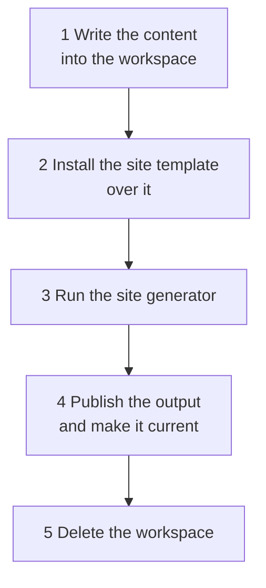

# Generating the documentation

The doc service does not only receive documentation, it publishes it: it runs the site generator over what it
knows, puts the result into the object storage and serves it. This page is about that half - what a build does,
what makes one happen, and what to look at when one does not.

## What a build is

A **documentation site** is one published whole: one navigation, one layout, one search. Which sites exist is
[configuration](configuration.md#documentation-sites); each of them is generated and published on its own, and
each has its own **environments** - trees of the same documentation showing the state of a different stage.

One run of the generator is a **build**, and a build is five steps:



The order of the first two is not a detail. **The content is written first and the site template is copied over
it**, and everything at the top level of the workspace that is neither the content nor the template's own is
removed. The application that runs is therefore the template's, byte for byte and at every depth, whatever was
generated into the content directory - which is what will keep documentation uploaded by a team from being able
to become part of the program that builds the site.

## What is in a build

Two kinds of documentation end up on one site. A page is one or the other, never both.

|               |                                                                                                                                                                                                       |
|---------------|-------------------------------------------------------------------------------------------------------------------------------------------------------------------------------------------------------|
| **Generated** | Written by the doc service from the architecture model of the environment being built: what the systems are, who owns them, how they are decomposed, what they exchange. Rewritten whole on every run |
| **Custom**    | Written by the team that owns a system, next to its code, and uploaded by its pipeline. The generator never writes those pages and never reads them                                                   |

A generated page says so. Its front matter carries `doc_status: generated` and where the content came from, and
its foot names the environment it was generated from and when - when the model was imported and when the page
was built. A page that would be half generated is two pages instead.

### The structure template

Where a page is served follows from the **structure template** the documentation is organised by. The doc
service ships [arc42](https://arc42.org). A further structure template is a further module - see
[Structure templates](structure-templates.md) for what a template is and how to add one. The layout below is
what arc42 produces:

```text
/systems/                                                              every system, with its team
/systems/orders/                                                          what the system is, and its structures
/systems/orders/system-architecture/                                      arc42 for the system
/systems/orders/system-architecture/intro/                                1. Introduction and Goals
/systems/orders/system-architecture/context-and-scope/                    3. Context and Scope
/systems/orders/system-architecture/context-and-scope/system-context-view/
/systems/orders/system-architecture/building-block-view/                  5. Building Block View
/systems/orders/system-architecture/building-block-view/whitebox-view/
/systems/orders/system-architecture/building-block-view/components/orders-foo-bar-service/
/systems/orders/system-architecture/building-block-view/events/orders-payment-accepted-event/
/systems/orders/system-architecture/building-block-view/commands/orders-check-availability-command/
/systems/orders/system-architecture/runtime-view/                         6. Runtime View
```

Four rules follow, and an upload has to keep the first three too:

- **The chapter folder carries its arc42 number, the URL does not.** A chapter is the folder
  `5-building-block-view`, is served at `/building-block-view/`, and reads as *5. Building Block View* in the
  navigation. Links then survive a renumbering. A relative Markdown link between two pages of a repository
  still resolves once they are published.
- **A chapter with nothing in it does not exist.** The generator creates the four it has something to say
  about. A gap in the numbering means a chapter has not been written, not that it is empty.
- **A component lives inside the building block view.** A component is one of the blocks, so its documentation
  sits where the decomposition is described, next to the events and commands that flow between them.
- **A message is documented under its name, kebab-cased.** `OrdersPaymentAcceptedEvent` is served at
  `.../events/orders-payment-accepted-event/`. Every message of the model gets its page: the segment is derived
  and checked by [the import](architecture-import.md#every-name-becomes-a-slug), which refuses a name that
  yields none, one that would be the listing of its group, and two that yield the same - so no page can be
  written over another. The building block view links to a group of messages only when the system defines
  one of that kind.

### The diagrams

A diagram is **fenced source, never an image**: the page carries the PlantUML and the site's plugin renders it
in the reader's browser, so a diagram stays searchable, diffable and readable as text. Nothing generates a
`.png` or an `.svg`.

Two pages carry one:

- **The system context view**, in *3. Context and Scope*, draws the system in the middle and every other system
  it exchanges something with around it. It is laid out **left to right**, because a star of two ranks is a
  narrow column that way and a wide ribbon the other way.
- **The level-1 whitebox view**, in *5. Building Block View*, carries **two** diagrams of the same system:
  *Inside the system* - its components and what flows between them, and nothing else - and then *With the
  neighbouring systems*, which adds every other system as a single box. The first is the one to read for a large
  system; the second says where it sits in the landscape. Both are laid out **top to bottom**, which is where
  the ranks of a graph of components calling components belong.

The whitebox page draws *Inside the system* only when the components of the system actually exchange something.
Otherwise the two diagrams would be the same boxes twice.

**An arrow is labelled with what travels along it, up to a limit.** Above
[`max-edge-labels`](configuration.md#the-architecture-model) names, the arrow shows the count for its kind
instead - `5 Events`, `6 Commands`, `3 REST Calls` - and the page says so in a note. The names are never lost:
the **Relations** table of the whitebox page and the **Neighbours** table of the context view list every
relation with everything travelling along it, each linked to its message page where the system defines the
message.

The cap is not a matter of taste. The diagram engine lays a label out by recursion and overflows the browser's
stack at about sixty lines, and a diagram that fails to render is an error box on the page that fails no build -
so an arrow of a busy system has to be summarized for the diagram to exist at all.

The same holds for the boxes: above [`max-diagram-nodes`](configuration.md#the-architecture-model) other
systems, a diagram leaves the rest out and says how many. A system's own components are never left out - every
one of them has a page, and one missing from the whitebox view would be a page no diagram points at.

### Where the generated content comes from

The doc service **imports** the architecture model of each environment from its
[architecture repository](configuration.md#the-architecture-model), on a schedule of its own, and a build reads
what was imported. A generation run makes no call to the architecture repository at all, so a repository that
is being deployed cannot fail a documentation build - see [the import](architecture-import.md).

What a page shows is therefore the landscape as one import stored it, and every generated page says which
import that was, next to when the page itself was built. **The two are read together, out of one snapshot of the
database**, so a page never names an import its content did not come from - and an import that commits while a
build is reading can neither tear the landscape nor change it under the build. What the build generates from is
the model as it stood when the build started.

Note that the timestamp on a page is not the same thing as the staleness warning in the log. The page names the
import its content came from; the warning names how long ago the architecture repository was last read
successfully, which is what says whether the import is still working. A landscape nobody has changed for a
month is not stale - every import in between read it and wrote nothing.

An environment with no architecture repository is a legitimate configuration. Its tree carries the root page and
whatever was uploaded into it, and no build fails over it.

A site may say that it needs the model before it is published, with
`jeap.doc.sites.<site>.architecture-model-required` - the default. Such a site is **not published until its
model has been imported once**: the build is postponed rather than failed, so its request stays standing and
the next poll tries again. The only window this covers is the one between an instance starting and its first
import finishing.

### What a message page shows

A message type gets a page of its own under the building block view of the system that defines it: what it is,
its topic and scope, the contracts on it - and its **versions**, as a table of what exists.

Where the [message schemas](architecture-import.md#the-message-schemas-asked-about-every-run-fetched-only-when-they-move) have
been replicated, that table names each version's key and value schema and links them into the message type
registry, says what the version is compatible with, and a section under it carries each schema in full.

The schema is fenced as `java`, which it is not. What is stored is the architecture repository's **rendering** -
every `import idl` inlined, the base types dropped, the namespaces and the enclosing braces removed - and it is
deliberately not valid Avro IDL. There is no language that highlights it correctly, and Java is close enough to
read while being wrong enough that nobody mistakes it for the file; the link beside it is where the file is.

A version whose schemas were never replicated - a new one, or one a run missed at its deadline - keeps its row
in the table and simply has no section. A replication that is behind never costs a page.

### The page that describes the documentation

Every environment tree carries an **About This Documentation** page, at `/about-this-documentation/`, linked
from the root page and from the footer. It answers what a reader of a published site cannot otherwise find out:
what they are looking at, where it came from, and when it changes next.

| Section                         | What it says                                                                                                                                                                          | Where it comes from                                          |
|---------------------------------|---------------------------------------------------------------------------------------------------------------------------------------------------------------------------------------|--------------------------------------------------------------|
| What this is                    | The site, the tree, the documentation structures this instance generates, whether an upload publishes the site, whether it waits for the architecture model                           | The configuration, through `DocumentationProvenance`         |
| The publication you are reading | Which build produced this site and when - and the numbers of that run, fetched                                                                                                        | The build itself, and `about-this-documentation.json`        |
| The environments of this site   | Per environment: which tree it is, how many systems, components and messages its model contributed, when that content was imported and when the architecture repository was last read | The run, which has just read the landscape it generates from |
| When this changes               | The publication schedule and the import schedule, each with its next occurrence spelled out                                                                                           | `NextOccurrence` over the configured cron expressions        |

**One page per tree rather than one per site**, which is forced rather than chosen: the site template switches
Docusaurus' pages plugin off, so a page outside the environment trees cannot be served - and a single page in
the main tree would be linked from the others as `/about-this-documentation/`, which the environment-links
plugin prefixes with the reader's tree, giving a route nothing wrote and a build that fails on a broken link.

#### The numbers of the run, and why they are fetched

A page cannot describe the build that writes it. The pages, the bytes, the duration and the memory peak are
known when the generator has finished; the page was written at the start of the same run. Printing the previous
publication's numbers instead would print numbers that are not the reader's.

So the run writes them **at the seam** - after the generator, before the upload, while the site is still on
local disk:

```text
generate()                                 the content, the template, Docusaurus
  └─ pageCount, sizeInBytes, generatorMillis         ◀ the numbers exist here
describeRun(...)  ──▶  about-this-documentation.json  ◀ written into the output
publish(prefix, directory)                            the upload
```

The page links that file absolutely and a client module of the site template fetches it, takes **only its
path** so the request is same-origin whatever `jeap.doc.publication.url` says, and fills a table in after the
heading. Everything about it degrades quietly: a reader with no scripts, an older publication without the file
and a fetch that fails all get the page as written, which is why the sentence under that heading names the file
rather than relying on the table appearing.

### Search is the environment the reader is in

The environments hold the same pages, so one index over all of them would answer every query with the same page
once per environment and leave the reader to find the tree they are already in. The index is therefore split one
part per environment, and **the search box takes the part from the page it is on** - no setting, nothing to
choose. A reader on the DEV tree searches DEV.

The parts are separate files and a page loads only its own, so it is not a filter over the results: a PROD hit is
not something a DEV page has and hides, it is something it never fetched.

The search page at `/search` is the exception, because it is one page at the site root and cannot take the
environment from its own path. It reads it from the `ctx` query parameter, which the search box puts into the
link it offers, and it carries a selector for changing it.

## What makes a build happen

Three things ask for one, and none of them builds:

|                  |                                                                                                                                                                                                                                         |
|------------------|-----------------------------------------------------------------------------------------------------------------------------------------------------------------------------------------------------------------------------------------|
| **An upload**    | Documentation was uploaded for a site, and that site is published on upload                                                                                                                                                             |
| **The schedule** | The site's `publication-schedule` came round                                                                                                                                                                                            |
| **An operator**  | Somebody asked over the API - `POST /api/sites/{site}/builds`, see [API](api.md). It ignores `publish-on-upload`: a site published only when something is uploaded to it is exactly the site somebody has to be able to publish by hand |

All three leave the same thing behind: a **request** for that site, at most one at a time. Everything else
follows from that.

### Several triggers are one build

A request that is already pending is left exactly as it is, and the request is taken - cleared - at the *start*
of a build, before anything is read. So every trigger arriving while a build runs finds the flag clear and sets
it again, and **the next run serves all of them at once**. Three uploads during a running build produce exactly
one further build, not three.

### One build of a site at a time

A build holds a lock named after its site, so two instances never build the same site at once - and two
*different* sites are built in parallel, because a site that takes ten minutes must not hold up one that takes
ten seconds. One instance builds one site per cycle: a build is a process that wants a core, and three pending
sites must not become three of them inside one container.

An instance that dies mid-build holds its lock until the lease expires. The next build of that site marks what it
left as `ABANDONED`, which is what turns a row that would otherwise say `RUNNING` for ever into a fact.

## What a build leaves behind

Every run is a row in `documentation_build`, and it is what to read first:

| Column                        |                                                                                                                                   |
|-------------------------------|-----------------------------------------------------------------------------------------------------------------------------------|
| `state`                       | `RUNNING`, `SUCCEEDED`, `FAILED`, `ABANDONED` or `ABORTED`                                                                        |
| `trigger_kind`                | `UPLOAD`, `SCHEDULE`, `MANUAL` or `RECOVERY` - why this run happened                                                              |
| `started_at`, `finished_at`   | when, and for how long                                                                                                            |
| `instance`                    | which instance ran it, for a log search                                                                                           |
| `object_prefix`               | where its output lies                                                                                                             |
| `page_count`, `size_in_bytes` | what it produced                                                                                                                  |
| `docusaurus_millis`           | how much of the run was the site generator itself - the number that says whether a slow build is the generator or the doc service |
| `failure_reason`              | what went wrong, with the last lines of the generator's output when that is what went wrong                                       |

**The published site of a site is its newest `SUCCEEDED` row.** There is no second place saying which site is
served, so there is no second place that can disagree with it.

Old rows are removed nightly, after `jeap.doc.build.history-retention` - **except the published one of each
site**, which is kept whatever its age. A site that is only ever built when something is uploaded to it would
otherwise lose the row that says it is published at all, and start answering that it has never been generated.

## How a site is published without a gap

The object storage has no transaction to borrow, so the design does not ask it for one:

1. the generated files are written under `sites/<site>/<build>/`, a prefix nothing points at yet;
2. **one row** moves the build to `SUCCEEDED` - and that is the publication;
3. only then are the sites past `jeap.doc.build.retention` deleted.

A reader therefore sees the whole previous site or the whole new one, never a mixture and never a gap. A build
that fails, or an instance that dies at any point, leaves the site published before it exactly as it was; the
worst it costs is objects nothing references, which the retention removes on the next run and the bucket's
lifecycle rule removes if there is no next run - see [Operating the bucket](operating-the-bucket.md).

## The build workspace

A build works in `jeap.doc.build.workspace-directory/<build>` and deletes it afterwards. It holds one build's
scratch files and outlives nothing, so **it belongs on storage that belongs to this container alone** - the
writable layer of a task on ECS, an `emptyDir` on Kubernetes.

A process that is killed leaves its workspace behind, so the directory is also swept: **a workspace may be
removed when its build is not running**, whichever instance created it. That one rule is what makes the sweep
safe while other instances are building, and it is why the leftovers of an instance that never comes back are
removed by whichever instance builds next. It runs before every build.

## What a stop does, and what happens when it cannot

A build runs for minutes, so a deployment lands on one sooner or later. Two things make that survivable, and
they are worth telling apart: **one makes it quiet, the other makes it correct.**

### The stop itself

An instance being stopped destroys the site generator and records what it was doing, before the context destroys
its beans and takes the connection pool with them. It happens in this order, each step on its own and none of
them able to stop the next:

1. **The build is recorded as `ABORTED`** - not `FAILED`. Nothing about the generator is wrong, and the alarm is
   on failures, so a deployment must not page anybody. The meter says `result="aborted"`.
2. **The site's lock is given back**, so another instance may build it at once rather than after the lease.
3. **The build is asked for again**, so it runs within a poll interval instead of waiting for the next upload or
   schedule. The trigger it carried is the one restored.
4. **What it had already uploaded is removed.** Those objects are referenced by nothing - the retention only
   deletes what a *successful* build published - so the bucket's lifecycle rule is what removes them if this
   step does not get to run.

The whole of it is bounded by `jeap.doc.build.shutdown-timeout` (15 seconds), which is a hard limit rather than
a target: overrunning `spring.lifecycle.timeout-per-shutdown-phase` would let the context destroy the connection
pool while the build thread is still writing, which is the state this exists to avoid.

### The stop timeout of the platform

`spring.lifecycle.timeout-per-shutdown-phase` applies **per phase**, and this service has three that can wait -
the web server's graceful stop, the build's, and the one the scheduler and the architecture import executor
share. At the default of 20 seconds the worst case is therefore about a minute, and **the platform's stop
timeout has to be above it**:

|            |                                                                                                                                   |
|------------|-----------------------------------------------------------------------------------------------------------------------------------|
| ECS        | `stopTimeout` on the task definition, **90** seconds. The default is 30, which lands inside the shutdown and turns it into a kill |
| Kubernetes | `terminationGracePeriodSeconds`, likewise 90                                                                                      |

An architecture import that is running does not spend that last phase's timeout. It takes minutes, so a
deployment would otherwise wait for a run that cannot finish and then interrupt it; instead it is told that the
instance is stopping and gives up between two requests, which costs about the time one request takes. What it
did not import is imported by the next schedule - see [The architecture model](architecture-import.md).

### When it cannot record anything

A container that is killed outright - `stopTimeout` too short, an out-of-memory kill, a host failure - writes
nothing at all. **The recovery does not depend on it.** What is left behind is a build still marked as `RUNNING`,
and that row is itself the evidence that a build is owed:

- its site's lock is leased for `jeap.doc.build.lock-lease` (2 minutes) and extended in the background only
  while an instance is alive to extend it, so the lock frees itself two minutes after the instance dies;
- the next instance to poll takes that lock, marks the run `ABANDONED`, counts `jeap.doc.build.abandoned`, and
  **builds the site again as `RECOVERY`** - the request cannot say a build is owed, because it was claimed when
  the build started, so the row says it instead;
- its workspace is swept, because a build that is not running no longer protects its directory.

So a killed instance costs a site about two and a half minutes and one `abandoned` count. A build that was
itself a `RECOVERY` and is lost again is **not** retried a second time: one automatic attempt is a crashed
instance, two in a row is a build that kills whatever runs it, and repeating it would be a crash loop.

## When something is wrong

|                                               |                                                                                                                                                                                                                                                                                                                                                                                                        |
|-----------------------------------------------|--------------------------------------------------------------------------------------------------------------------------------------------------------------------------------------------------------------------------------------------------------------------------------------------------------------------------------------------------------------------------------------------------------|
| **The site is not updating**                  | `GET /api/sites` answers it: the schedule, whether it is published on upload, what is pending, what is running and what was last built. A site with no `publication-schedule` is published only when something is uploaded to it                                                                                                                                                                       |
| **Builds are failing**                        | `documentation_build.failure_reason` carries the last lines of the generator's output. `jeap_doc_build_seconds_count{result="failed"}` is the counter                                                                                                                                                                                                                                                  |
| **A build hangs**                             | It is given up on after `jeap.doc.build.timeout` and the process tree is killed. If that happens repeatedly, look at the memory the container has - see [The site image](site-image.md)                                                                                                                                                                                                                |
| **A build is slow, or grows**                 | The `[PERF]` lines the service logs at `INFO` while a build runs say how long each phase of the generator took and what the Node heap held before and after it, nested by phase - so the phase responsible has a name. `jeap.doc.build.perf-log` switches them off                                                                                                                                     |
| **The generator exits with 137**              | The container's memory limit killed it. The failure reason carries what the container held while that build ran, `jeap_doc_container_memory_used_bytes` shows when it climbed and how far, and `jeap_doc_container_memory_oom_kills_total` counts the kills - see [Observability](observability.md#the-memory-of-the-container) and [The site image](site-image.md) for what to size                   |
| **`GET /` answers 503**                       | Nothing has been published for that site yet. It is not a wrong URL: the first successful build answers it                                                                                                                                                                                                                                                                                             |
| **Nothing is picked up at all**               | `jeap_doc_build_request_age_seconds` grows. Either no instance is running the schedule, or a lock is held by an instance that has gone - which resolves itself within `jeap.doc.build.lock-lease`. A running architecture import is not a cause: the imports have a thread of their own and never hold a scheduler thread (they did once, when every scheduled task ran on the lock keep-alive thread) |
| **`jeap.doc.build.abandoned` keeps counting** | Containers are being killed rather than stopped. Check the platform's stop timeout against the budget above, and the memory the container has                                                                                                                                                                                                                                                          |
| **A site stopped rebuilding after a crash**   | Look for a build with `trigger_kind = RECOVERY` and state `ABANDONED`: the automatic retry was used up, which means the build kills the instance running it. It waits for an upload, its schedule, or a `POST /api/sites/{site}/builds`                                                                                                                                                                |

What to alarm on, and the rest of the meters, is [Observability](observability.md).

## Related

- [Structure templates](structure-templates.md) - what a template is and how to add one
- [The scheduled jobs](scheduled-jobs.md) - the poll, the publication schedules and what else runs on its own
- [Configuration](configuration.md) - the sites, their environments and the build
- [Observability](observability.md) - the meters and what to alarm on
- [The site image](site-image.md) - how an image with the site generator is built
- [Operating the bucket](operating-the-bucket.md) - what has to expire and what must not
- [Uploads](uploads.md) - what happens before a build
