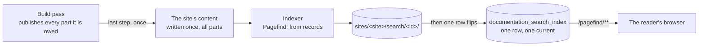

# Searching the documentation

A reader searches from a box in the navbar, with results while they type, and from a results page at
`/search`. Both search **the environment the reader is in** and **the whole site** - every system of it, not
the part the reader happens to be on.

That last part is the whole difficulty. A site is published as [one build per part](generation.md), so an index
built inside a build would cover one part and a reader inside one system would find only that system. So the
index is built once, over everything, outside every build.



## When it is built

**At the end of the build pass that published the site.** A pass builds every part it is owed, publishes each
as it finishes, and then indexes the sites it published a part of - once, whatever the number of parts.

**Once per publication, not once per instance.** The parts of a publication are built by several instances and
each of them reaches the end of its own pass at its own time, so a run that finds the site's current index
already newer than its newest publication builds nothing: the site's lock alone is taken and released per run
and would let the second instance index the same content again. The comparison is against when the current
index *began*, because a run writes the content it indexes at the start.

There is **no schedule**, and nothing to ask for by hand. A site is indexed when it changes and at no other
time, and a pass that built nothing indexes nothing - so the way to reindex a site is to publish it
([API](api.md)), which is the only thing that could have made the index wrong in the first place.

**Indexing cannot fail a publication.** The parts are already being served by the time it runs, so a site whose
index could not be built goes on being searched with the index it had before. What that costs is an error in
the log and a row saying why, and the next pass that publishes anything puts it right.

What it costs a reader: the index lags the site **for the length of a pass** - seconds for the ordinary pass
that builds one part after an upload, minutes for a full publication.

## What is indexed

One record per page: its title, its headings and its body text, plus **where the page is** - the system, and
the component or library it documents.

- **The Markdown, not the built HTML.** A page someone uploaded is therefore indexed by the same code as a
  generated one, and it needs no build to have run.
- **The route, not the path.** The chapter folders are numbered on disk (`5-building-block-view`) and
  Docusaurus serves them without the number (`building-block-view`), so the number comes off every segment of
  a record's URL. It is the same rule the [upload validation](api.md) applies to a document's name, and it
  lives in one place for both - `NumberPrefixes`. An explicit `slug` in the front matter is left as written,
  because that is what Docusaurus does with it.
- **Fenced blocks are skipped** - PlantUML, GraphViz, Mermaid, Avro. Nobody searches for `skinparam`, and on a
  database schema page the fences are most of the words.
- **`snake_case` survives.** An underscore is an emphasis marker in Markdown and it is also what every table
  and column name is made of; splitting `tenant_reference` in two is how a reader searching for the identifier
  in front of them finds nothing.
- The environment goes in as a **filter**, not as an index of its own, and so are the two facets below.

### What a record says it is

Every record carries two values a reader can narrow by, and every value comes from something the page already
says:

```
source   generated | markdown | html        what produced it
subject  system    | component | library    what it documents
```

| | |
|---|---|
| `source` | From the page's own `doc_status`, which is also what the provenance block under it is built from - so a search result and the page it opens cannot disagree. A page that frames an uploaded microsite, and every record of a file inside it, is `html` |
| `subject` | From where the page lies. **A library is not a component**: it publishes no artifact and is deployed nowhere, so no architecture model holds one and every chapter of it was written by hand |
| Neither | The site's own pages - the root, the systems index, *About This Documentation* - document nothing, so they carry **no** `subject` value at all. A search narrowed to a subject leaves them out, which is the reasonable reading of *show me the components* |

### The content of an uploaded microsite

A microsite is published as it was built and served file by file, so its pages are in no content tree and no
build ever writes them. Their text reaches the index another way:

| | |
|---|---|
| **Extracted when it is uploaded** | The bundle is open at that moment, the set cannot change until the next upload, and the same set is published into every environment the subject is documented in - so the HTML is parsed once rather than once per publication |
| **Stored beside the files** | One object under the set's own prefix, so that removing the set removes it. `_jeap-search.tsv` is therefore a name an upload may not carry, and one that does is refused |
| **Bounded** | `jeap.doc.search.max-microsite-pages` pages per set, the entry point first, and `max-microsite-page-bytes` of each. The reason is flooding rather than size: a Javadoc of 519 pages costs a reader five kilobytes up front but filled ten of ten first hits for a common word |
| **`.html` and `.htm` only** | Everything else a microsite carries is an asset of one of those pages |
| **A hit opens the page that frames it**, at the file that matched - the URL is that page plus `?path=…`, so the reader keeps the navigation around them |

**The cap is applied when the set is uploaded**, not when the site is indexed, so lowering it takes effect on
the next upload rather than on the next publication.

> **A microsite uploaded while `jeap.doc.search.enabled` was off carries no text**, and only the page that
> frames it is findable. Uploading the set again is what puts that right - there is nothing to re-run, because
> the text is only ever produced from a bundle that is being received.

## What a reader gets

| | |
|---|---|
| The box | In the navbar, on every page of every part. Results appear as they type, `Ctrl`/`⌘`-`K` focuses it from anywhere, the arrow keys move through the results, `Escape` closes them |
| What a result shows | Its title, a badge saying **what kind** of documentation it is, **where it is** - the system, the component or library, and the uploaded microsite it was found inside, because every component of a system has a page called *6. Runtime View* - and the text around the match, with the matched words marked |
| Narrowing it | **Six chips in two groups**, all selected to begin with: the first thing a reader sees is every result, and the chips take things away. They are in the URL (`&source=…&subject=…`), so a narrowed result set is a link somebody can share, and a search nobody has narrowed writes no parameter at all. Each chip says how many results it would bring **in the environment the reader is in**, from a second search that narrows by nothing else: the search beside it counts only within what it narrowed to, so a chip that is off would read zero - and the index answers no counts at all for a group a query never names. At least one chip of each group stays selected |
| The box in the navbar | Carries the **source group alone**. Six chips wrap onto two rows in a dropdown and cost a result where vertical space is scarcest, and *what produced it* is the question a reader has while typing. What it has set travels with *See all N results* |
| The results page | `/search/?q=…&env=…`, behind *See all N results*. It belongs to the **shell part** - the only build that owns the site root - and every other part links it unchecked, the way it links the front page. It carries **a box of its own**, so that a reader who has arrived there goes on searching rather than back to the navbar; what they type becomes `q`, so a result set stays a link they can share |
| Following a hit | **A page load, never a client-side route.** The index spans the whole site while each build's router knows only its own part, so a hit is routinely a page this build has no route for - routing to it would answer with that build's own *Page Not Found*. It is the same rule the generator follows when it rewrites a link that leaves a part to `pathname://` |
| The environment | Taken from the URL, through the same derivation the environment switcher uses - and on the results page, which has no tree to take a scope from, out of `env`. **There is one environment control on this site and it is the navbar's**: on the results page it rewrites `env` instead of the path, because `/dev/search/` is a page no part serves |
| A site with no index | No box at all. A search that finds nothing looks broken; a site without one does not |

**Only the box is bundled with the site.** The engine and the index are fetched at run time from
`/pagefind/…`, same origin, which is all the site's `Content-Security-Policy` allows.

## Where an index lives

Under the site prefix of the same bucket the published sites are in, **one prefix per index, named after the
run that produced it**:

```
sites/<site>/search/<index>/pagefind/pagefind-entry.json      the manifest
                                    /pagefind.js              the loader
                                    /wasm.en.pagefind         the engine
                                    /pagefind.en_<hash>.pf_meta
                                    /index/<hash>.pf_index    fetched per query
                                    /fragment/<hash>.pf_fragment   one per page, per result shown
                                    /filter/<hash>.pf_filter
```

A reader downloads the first four and the filter index before their first query - together a fraction of a
megabyte, near enough constant however large the site is - and then a chunk or two per query and one fragment
per result displayed.

**A prefix per index rather than one per site**, because every filename above carries a content hash: a browser
that has loaded one index's manifest goes on asking for chunks by names only that index's prefix has. Writing a
new index over the old one would answer the next keystroke of a reader who is already searching with a `404`.
So an index is written under a new prefix and made current by **one row**, exactly as a part publication is.

## How they are cleaned up

| What | Removed by |
|------|------------|
| The index a new one replaced | The run that replaced it, as soon as its own is being served. `jeap.doc.search.retention` (2) of them are kept, so a reader mid-query still has the one they started with |
| What an **interrupted** run wrote | `SearchIndexHousekeeping`, nightly. An instance killed between writing the files and recording that it had leaves a prefix and a row saying it is still running, and nothing else in the service can reach either |
| The record of a **failed** run | The same job, after `jeap.doc.search.failure-retention` (30 days). It is evidence of what went wrong, which is worth a month |
| The **workspace** a run works in | The next run of that site replaces it, and the workspace sweep at the start of a build pass takes one that has lain untouched for a day - which is what clears the workspace of a site that has left the configuration and that nothing indexes any more |

The nightly job is safe to delete by age - where an age rule over the published sites
[is not, at any value](operating-the-bucket.md) - because **it only ever touches runs that were never
published**, and what a site is served from is one that was.

A run's prefix is worked out from its identifier rather than read from its row. That is what makes the files of
a crash findable at all: a run that died before publishing never recorded where it had written.

## Configuration

See [Configuration](configuration.md) for the table. The two worth knowing about:

- **`jeap.doc.search.enabled`** is the way out when the service and the image do not ship together. The indexer
  is a native binary that arrives with `node_modules`, so an instance whose image predates the search fails its
  startup check - unless this is `false`, which skips the check and the indexing both.
- **`jeap.doc.search.retention`** is refused below **2**, and `jeap.doc.search.abandoned-after` is refused at or
  below the lock lease. Both for the same kind of reason: one would take an index away from a reader who is
  still using it, the other would delete the files of a run that is still writing them.
- **`jeap.doc.search.max-microsite-pages`** (200) and **`max-microsite-page-bytes`** (512KB) bound what one
  uploaded microsite contributes. They are applied while a set is being received, so a change takes effect on
  the next upload.
- **`jeap.doc.html.ignored-selectors`** is what is dropped from an uploaded page before its text is taken -
  the scripts, and the navigation a generated documentation site repeats on every one of its pages. A
  generator whose furniture is not on that list costs excerpt quality and nothing else.

## What a build of the index does not decide

`pagefind-index.mjs` decides nothing about what is indexed: every record arrives ready-made, one JSON object
per line. A group of filters a reader has fully selected is not sent at all, because **a record with no value
for a key a query names is excluded** - which is what makes the site's own pages behave when a subject is
narrowed, and what would silently hide every microsite hit if a record were missing its environment.

> **A group is sent as `{any: [...]}` and never as an array.** An array is read as *all of these at once*, and
> since a record carries one value per key, a two-value array returns nothing - without an error.

## When there is no search on a site

In this order:

1. **Has the site been published since the search was released?** The index is built by a pass, so a site
   nobody has republished has none. Ask for the site to be published - `POST /api/sites/{site}/builds`.
2. **Does `/pagefind/pagefind-entry.json` answer?** A `404` means no index is current for that site. The box
   hides itself in that case, which is what you would see.
3. **What does the log say?** A successful run logs one line per site with the page count and the milliseconds.
   A failed one logs an error and leaves a row with the reason.
4. **Is `jeap.doc.search.enabled` on**, and did the startup check pass? An instance whose image has no
   `pagefind` in `node_modules` says so while it starts - see [The site image](site-image.md).

## Related

- [Generating the documentation](generation.md) - the build pass this is the last step of
- [Operating the bucket](operating-the-bucket.md) - what may and may not expire
- [The scheduled jobs](scheduled-jobs.md) - the nightly clean-up
- [The site image](site-image.md) - the indexer's binary
