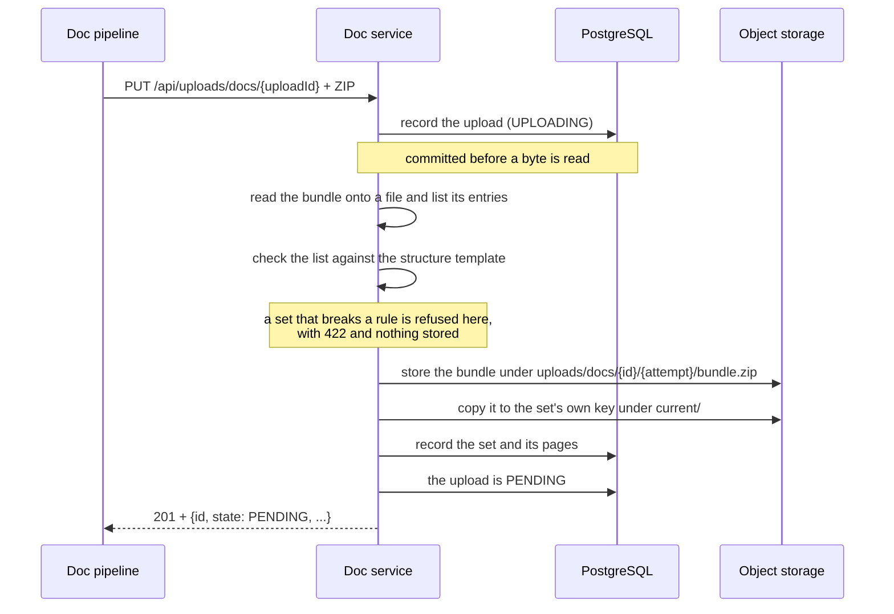

# Uploads

How documentation gets into the doc service: what happens to a bundle after it arrives, how far an upload gets,
and what a retry does. For the endpoint itself and its parameters see [API](api.md).

## What happens to a bundle

An upload is written to the database **before** its bundle is read, and stored on S3 afterwards:



Three rules are worth knowing, because everything else follows from them:

- **The database comes first.** A recorded upload without an object is a visible state that can be retried; an
  object without a row would be documentation nobody knows about.
- **No transaction is open while the bundle streams.** The upload is committed, then the bundle is transferred,
  then the result is written - a slow pipeline holds no database connection.
- **Nothing is stored until the set is accepted.** What the rules ask about is the list of paths, and that is
  read from the archive's own table of contents without unpacking a single entry - so a refused upload leaves
  no object behind and no set to undo.

## The state of an upload

| State       | Meaning                                                                                               |
|-------------|-------------------------------------------------------------------------------------------------------|
| `UPLOADING` | The upload is recorded and its bundle is on its way. One attempt holds the upload id while this lasts |
| `PENDING`   | The set is **current** and the upload is waiting for the **publication**: a build was asked for, and its pages appear when that build runs |
| `FAILED`    | The set was refused, or its bundle could not be stored. Nothing of it is published, and a retry under the same upload id replaces the attempt |

On its way to the object storage a bundle is spooled to a file in
[`jeap.doc.storage.spool-directory`](configuration.md#object-storage) rather than kept in memory, and the file is
deleted as soon as the transfer is over.

**What was stored is recorded with the upload**: where the bundle lies and the SHA-256 of the bytes that went
into the object storage, so what lies there can be held against what a pipeline sent. The digest is computed by
the service itself; an upload does not send one, the service does not hand it to the object storage, and only the
attempt whose bundle the upload names is recorded - the digest says what the upload points at, not what every
attempt sent.

**Every attempt writes its own object**, under its own number: an attempt that was taken over as abandoned is not
dead, only slow, and it will finish and write. Without a place of its own it would replace the bundle of the
attempt that took the upload over, and the upload would then describe - down to its digest - other bytes than the
ones lying there. The upload names the object of the attempt that won; what a straggler wrote is left behind and
belongs to nothing.

The incoming documentation is stored **separately from the generated documentation**, under the configurable
prefix of [`jeap.doc.storage.upload-prefix`](configuration.md#object-storage), and the identifier the doc service
gives an upload is the path its bundle lies under.

## Idempotency: what a retry does

`uploadId` is the **idempotency key** of the API. One upload id is one upload: repeating the `PUT` under it never
produces a second documentation set and never a second upload - so a pipeline may retry without asking whether its
previous attempt got through. What a repetition does depends on what became of the attempt before it.

| The upload id                                           | What the request does                                                               | Answer                                              |
|---------------------------------------------------------|-------------------------------------------------------------------------------------|-----------------------------------------------------|
| is unknown                                              | The upload is recorded, its bundle stored                                           | `201` with the result                               |
| belongs to a stored upload                              | Nothing is written, the body is read and discarded                                  | `200` with the result of the attempt that stored it |
| belongs to a failed upload                              | The upload is claimed again and the bundle stored, under the key of the new attempt | `201` with the result                               |
| belongs to an upload another attempt is receiving       | Nothing happens - the body is not even read                                         | `409` `UPLOAD_IN_PROGRESS`, with `Retry-After`      |
| belongs to an upload that has been in progress too long | The attempt is taken over as abandoned                                              | `201` with the result                               |
| belongs to an upload that describes something else      | Nothing is written                                                                  | `409` `UPLOAD_ID_CONFLICT`                          |

**A retry of an upload that is currently being received is refused, not queued.** An upload belongs to one
attempt at a time: it names one bundle, and two attempts filling it at once would make it a race which one it
ends up naming. The second is told when to come back instead - and if the first finishes in the meantime, the
retry is answered as a repetition of it.

**An abandoned attempt frees itself.** A service that dies while a bundle streams leaves an upload in
`UPLOADING` with nobody to finish it. An upload that has been in progress for longer than
[`jeap.doc.upload.in-progress-timeout`](configuration.md#uploads) counts as abandoned and is taken over by the
next attempt.

**Nothing may differ between the attempts of one upload.** Every parameter is compared with the one recorded, from
`system` down to `build-url` and `generated-at`; any difference is `409 UPLOAD_ID_CONFLICT`. A retry re-sends the
request it sent before, so nothing it could send is different - anything that is comes from somewhere else: a
re-run of the workflow, an upload id that is not unique, a copied configuration. A **restarted workflow is not a
retry**: it uses a new upload id, and that is a new upload with its own bundle.

**The bundle itself is not compared.** The parameters are checked, the bytes are not - the service has no digest
of an upload before it has read it, and it does not ask a caller for one. A retry is therefore expected to send
**the same file again**, not to produce it again: a ZIP built a second time differs in its entry timestamps even
when the documentation in it is identical, and a workflow that regenerates its bundle before retrying is starting
a new upload, which is what a new upload id is for.

## How an upload is cleaned up again

An upload is not kept forever, and the two halves of it are removed by two different mechanisms - **the database
by the doc service, the object storage by the bucket itself**:

|                 | Removes                          | After                                                            | By                                       |
|-----------------|----------------------------------|------------------------------------------------------------------|------------------------------------------|
| The doc service | the upload in the database       | `jeap.doc.upload.housekeeping.retention`, **14 days** by default | a nightly job, `0 30 2 * * *` by default |
| The bucket      | the bundle in the object storage | **21 days**, in the lifecycle rule - see [Operating the bucket](operating-the-bucket.md#the-rules-to-provision) | the object storage |

**In that order, and not the other way round.** The lifecycle rule has to be set *longer* than the retention, so
an upload never points at a bundle that is already gone; between the two an orphaned bundle lies around for a
few days, which nothing reads and nobody misses.

**What this removes is the upload, not the documentation.** The set the upload became lives under its own
prefix and is not expired by anything - a component that publishes once and stays stable for a year is the
normal case. See [The documentation a team writes](custom-documentation.md#removing-documentation) for what
does remove one.

Everything older than the retention is removed **whatever state it is in**. An upload that is still `UPLOADING`
after two weeks belongs to a request nobody remembers, and one that is `PENDING` has had its set taken over
long since - the record of the request is what goes, and the documentation stays. The job is the only place
uploads go. What an upload documented is kept too: the system, component or library stays in the catalogue of
the documentation.

Of several instances of the doc service only one runs the job: it takes a lock in the database (`shedlock`) for
as long as it may run, and the others find it taken.

### The lifecycle rule

Every uploaded bundle is **tagged** `jeap-doc-content=upload` when it is stored, and the rule selects on that tag
rather than on the prefix - `jeap.doc.storage.upload-prefix` is configured per instance, so a rule written against
a prefix would have to know each instance's value, while the tag is the same everywhere.

The rule is provisioned with the bucket, by whatever infrastructure code creates it:

```json
{
  "Rules": [
    {
      "ID": "expire-jeap-doc-uploads",
      "Status": "Enabled",
      "Filter": { "Tag": { "Key": "jeap-doc-content", "Value": "upload" } },
      "Expiration": { "Days": 21 },
      "NoncurrentVersionExpiration": { "NoncurrentDays": 1 }
    }
  ]
}
```

In Terraform this is an `aws_s3_bucket_lifecycle_configuration` with the same filter and expiration.
`NoncurrentVersionExpiration` matters only on a versioned bucket, where an overwritten bundle would otherwise be
kept as a previous version.

**The rule must not select the sets.** It filters on `jeap-doc-content=upload`, and a set carries
`jeap-doc-content=current` for exactly this reason: the bundle of an upload is a staging copy, the set it
became is the only copy there is, and nothing under that prefix may be expired by age at any value. See
[Operating the bucket](operating-the-bucket.md#the-rule-that-must-not-be-written).

The service needs `s3:PutObject`, **`s3:PutObjectTagging`** - without it the upload fails with an access
denied while storing, because the tag travels with the object it writes - and `s3:CopyObject` and
`s3:DeleteObject`, which is how a set is made current and how one is removed.

## What is checked, and what is not

An upload is checked for what it says about itself: the parameters have to describe a documentation set (see
[API](api.md)), the bundle may not be larger than
[`jeap.doc.upload.max-size`](configuration.md#uploads), and it has to be as long as its `Content-Length`
announced.

**The structure of the bundle is checked on upload, and on request before it.** A pipeline may ask
`POST /api/uploads/docs/validation` before it builds the ZIP and get a finding per misfiled path; the upload
endpoint applies the same rules to the same paths, and refuses a set that breaks one with `422` and the
findings in the body. The rules are on [What an upload is validated against](upload-validation.md).

**A refused set leaves nothing behind.** The bundle is read onto a file and its list of entries decides before
anything is stored, so there is no object, no set, and an upload a retry can take over once the set is fixed.
Reading that list costs one seek and unpacks not one entry: everything the rules ask about is a path.

The **Markdown itself** - CommonMark, dead links, the front-matter allowlist - is the doc workflow's half of
the validation, before anything is sent; the doc service never sees a file's bytes. And nothing is scanned for
malware: that is descoped from this enabler.

## What happens next

An upload that stored its bundle **asks for the part that carries its system to be published**, unless that
site is configured not to be (`publish-on-upload`). It does not wait for the build: several uploads for one
system arriving while a build runs are one request, and the next run serves all of them - see
[Generating the documentation](generation.md).

**The set is taken over into the current documentation before the upload is answered.** Its bundle is copied
to a key of its own - a server-side copy, so the bytes never come back through the service - and the files it
holds are recorded. From then on the set is what a build reads; the uploaded bundle is a staging copy that the
bucket expires.

The upload itself stays `PENDING`, and the word still fits: what is pending is the **publication**. The set is
current, and the build that was asked for is what puts it on the site. See
[The documentation a team writes](custom-documentation.md).

## Related

- [What an upload is validated against](upload-validation.md) - the structural rules, per template

- [API](api.md)
- [Configuration](configuration.md)
- [Architecture](architecture.md)
- [Security](security.md)
- [jeap-doc-service](../README.md)
- [Generating the documentation](generation.md)
- [The scheduled jobs](scheduled-jobs.md) - when the housekeeping of the uploads runs
