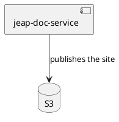
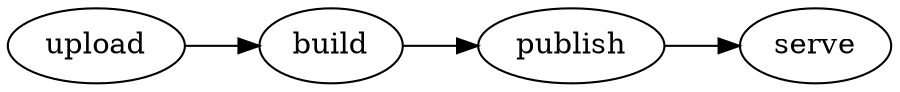

# Documentation

A fixture page, so that `npm start` serves something while the template is worked on. The site generator of the
jEAP Doc Service writes this directory; nothing here is packaged into the jar.

